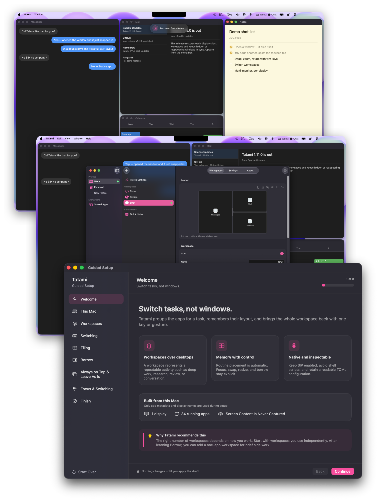

# Tatami 

[](https://github.com/PangMo5/Tatami/releases/latest)
[](https://github.com/PangMo5/Tatami/releases)

[](LICENSE)

A macOS workspace manager with BSP window tiling.

Tatami groups your apps into virtual workspaces you switch between with a
keystroke or a configurable trackpad gesture, and tiles their windows
automatically with a binary space partitioning (BSP) engine. No SIP changes and no shell
scripting required.

## Screenshots

<p align="center">
  
</p>

<p align="center"><sub>Full size:
<a href="Resources/Marketing/screenshots/guided-setup.png">Guided Setup</a> ·
<a href="Resources/Marketing/screenshots/workspaces.png">Workspaces</a> ·
<a href="Resources/Marketing/screenshots/borrow.png">Borrow</a><br />
Captured on an earlier version. Some labels have changed since these screenshots.</sub></p>

## Demo

<p align="center">
  <a href="https://pangmo5.dev/Tatami#demo">
    
  </a>
</p>

<p align="center"><a href="https://pangmo5.dev/Tatami#demo">▶ Watch the demo</a></p>

<p align="center"><sub>Recorded on an early version. It will be re-recorded for a later release.</sub></p>

## Features

### Workspaces

- **Virtual workspaces:** Group apps with per-workspace assignments.
- **Flexible switching:** Use a hotkey, trackpad gesture, or recent-workspace action.
- **Configurable gestures:** Bind every direction of a three- or four-finger swipe to any shortcut action, including profile- and workspace-specific commands.
- **One key per workspace:** Hold the switch, assign, or borrow modifier with a **key equivalent**. The same keys also drive recent, next, and previous targets, while any action can take an explicit override.
- **Optional switching behaviors:** Enable loop-around, skip-empty, or follow-app-focus.
- **Auto-open:** Launch assigned apps when a workspace activates and reopen them on re-entry if their window was closed.
- **Per-display workspaces:** Pin a workspace to a display or have dynamic workspaces open under the mouse. Each display keeps its own active and recent workspace across relaunches, while next/previous and recent navigation can independently stay local or span every display.
- **Cross-display control:** Jump focus between displays or move the focused app to another workspace.
- **Shared apps:** Add apps that should join every workspace.

### Window tiling (BSP)

- **Automatic BSP layout:** Insert new windows at the shallowest tile.
- **Keyboard operations:** Focus, swap, and resize directionally with vim-like `h`, `j`, `k`, and `l` keys.
- **Interactive window switching:** Tap the window-switch shortcut for an immediate switch, or hold its modifier for a compact app / window switcher. It shows each window's current state and lets you choose the exact target with the keyboard or pointer.
- **Zoom and splits:** Fill the workspace with one window or toggle split orientation.
- **Tree transforms:** Rotate, mirror, and balance the layout.
- **Drag editing:** Swap or re-insert a window with a live placement preview. Manual edge resizing synchronizes back into the tree.
- **Persistent layouts:** Keep each workspace's tree and ratios across workspace switches, relaunches, and system sleep.
- **Configurable spacing:** Set inner and outer gaps.

### Profiles

- **Independent profiles:** Group workspaces and switch the whole set at once. Each profile keeps its own workspaces, app assignments, and shortcuts.
- **Fast profile switching:** Switch by hotkey or from the menu bar. Every display re-tiles for the new profile, and Tatami returns to the right profile after relaunch.
- **Display-aware activation:** Auto-activate a profile by monitor count or by specific displays being connected or disconnected. Tatami warns when rules overlap at the same priority.
- **Profile identity:** Give each profile an SF Symbol shown in the sidebar, menu bar, and profile-switch feedback.
- **Reuse an existing setup:** **Copy from** and **Duplicate** share one preview where you keep or skip each workspace, app, setting, and saved layout before anything changes.

### Borrow: compose two workspaces

- **Side-by-side composition:** Pull another workspace beside the current one, dock it to any screen edge, and tile both blocks independently. Windows cannot cross the boundary.
- **Live and bidirectional:** The borrowed block is the real workspace, so edits persist back to it.
- **Directional placement:** Press the borrow modifier with a workspace key, then use `h`, `j`, `k`, `l`, or an arrow. You can also set a default edge and size globally or per workspace.
- **Cross-boundary focus and switching:** Directional focus and MFF move between blocks. Host and borrowed tiled windows share one app / window switching order until the borrowed workspace is returned. Activating a borrowed workspace switches to it fully, borrowing it again returns it by default, and `esc` cancels placement.
- **Visible ownership:** Borrowed windows show the borrowed workspace's icon.
- **Scratchpads:** Borrow-only workspaces stay out of regular switching, never activate alone, and auto-open their apps when summoned.

### Always on Top

- **Per-workspace or shared:** Keep an app on top in one workspace or add it to Shared Apps to keep it on top everywhere.
- **No SIP changes:** Tatami uses always-on-top ScreenCaptureKit mirrors, then hands you the real window when you interact with it.
- **Predictable stacking:** Multiple always-on-top windows stack by focus recency. This requires Screen Recording permission.
- **Leave As Is:** Keep an app as a workspace member for auto-open, focus, focus-follows-mouse, and window switching while preserving its current position and size. This mode needs no mirroring or Screen Recording.

### Focus & cursor

- **Two explicit focus models:** Focus-follows-mouse gives the window under the pointer keyboard focus. Mouse-follows-focus moves the pointer after Tatami changes windows, including switching to Always on Top, Shared Always on Top, or Leave As Is windows.
- **Close-window refocus:** Return to the most recently used remaining window.
- **Cursor control:** Optionally hide the cursor during a workspace switch.

### Interface & config

- **Five interface languages:** Use Tatami in English, Korean, Japanese, Simplified Chinese, or Traditional Chinese, following your macOS app-language preference.
- **Customizable menu bar:** Show the active workspace icon or name and, when relevant, the active profile icon or name.
- **Adaptive on-screen feedback:** Compact spring feedback confirms workspace, profile, Always on Top, membership, layout, and Borrow actions. The app / window switcher shows each target's state and works with both keyboard and pointer.
- **Workspace icons:** Choose a per-workspace SF Symbol.
- **Native settings:** Configure Tatami in SwiftUI.
- **skhd-style shortcuts:** For example, `ctrl + alt - h`.
- **Plain TOML:** Edit `~/.config/tatami/config.toml` with XDG support and live reloads.
- **Native hook editor:** Add, edit, delete, enable, or disable lifecycle hooks in **Settings → Hooks**, including their executable, argv, environment, working directory, and timeout.
- **Scriptable CLI:** Use domain commands such as `tatami workspace activate <workspace>` and `tatami workspace list`.
- **Automatic updates:** Receive releases through Sparkle.

### Guided setup

- **Learn by doing:** First launch walks through Workspaces, switching and gestures, BSP tiling, Borrow and scratchpads, Always on Top / Leave As Is, MFF / FFM, and app / window switching in a safe virtual display.
- **Built from this Mac:** Start from running-app metadata and connected-display geometry, then organize apps around repeatable work rather than generic categories. No screen contents are captured.
- **Optional AI planning:** Review a task-oriented proposal from ChatGPT, Claude, Gemini, another AI, or the on-device Apple Intelligence model on supported Macs. AI output remains a proposal until you apply it.
- **One cumulative practice surface:** Real shortcuts and trackpad gestures control the preview, and every command learned earlier remains available in later lessons.
- **Draft first:** Guided Setup does not move real windows or write `config.toml` until **Apply Setup**. Reopen it any time from **Settings → General**.

## Requirements

- macOS 14.0 or later
- Accessibility permission
  (System Settings → Privacy & Security → Accessibility)
- Screen Recording permission, only if you use Always on Top. Those windows'
  always-on-top mirrors are ScreenCaptureKit captures
  (System Settings → Privacy & Security → Screen Recording)

## Installation

### Homebrew

```sh
brew install --cask pangmo5/tap/tatami
```

Or download the signed & notarized `.dmg` from the
[latest release](https://github.com/PangMo5/Tatami/releases/latest). Each
release also links its exact corresponding source archive.

### Build from source

```sh
brew install tuist                     # or: mise install
tuist install && tuist generate --no-open
open Tatami.xcworkspace
```

## Configuration and automation

### Configuration

Settings live in `~/.config/tatami/config.toml`, grouped into tables such as
`[settings.layout]`, `[settings.focus]`, `[settings.gestures]`,
`[settings.shortcuts]`, and so on. Workspaces, their app assignments, and
shared apps are stored in the same file. Lifecycle hooks can be managed in
**Settings → Hooks** or as `[[hooks]]` entries in the file. The GUI keeps the
executable and each argv value separate rather than treating `command` as a
shell string. Edits made in the app or by hand are picked up live.

See [docs/CONFIGURATION.md](docs/CONFIGURATION.md) for the full reference:
every key, its default, and the shortcut syntax.

For app-specific window behavior, including floating meeting controls and
Picture-in-Picture across workspace switches, see
[Troubleshooting](docs/TROUBLESHOOTING.md).

### Command line

Tatami ships a `tatami` CLI inside the app bundle. Install it from
**Settings → General → Command Line → Install**. This symlinks `tatami` into
`/usr/local/bin` (you'll be asked for your password once). Then:

```sh
tatami workspace list
tatami workspace activate "Browser"
tatami profile activate "Dual"
tatami window focus left
tatami layout balance
```

The CLI covers profile/workspace management, hook inspection, stable JSON
output, and the same focus, layout, app, tiling, cycling, and Borrow commands
available to trackpad gestures, organized under domain subcommands. Tatami must
be running.

Read the [full CLI reference](docs/CLI.md), or view its live web rendering on
[pangmo5.dev/Tatami](https://pangmo5.dev/Tatami/cli.html).

## Tech stack

- **Tuist:** Project generation
- **The Composable Architecture (TCA):** App architecture
- **swift-sharing:** Cross-feature state sharing
- **swift-collections:** Ordered sets, dictionaries, and deques on tiling hot paths
- **swift-toml:** Config persistence
- **swift-subprocess:** Cancellable, bounded hook execution
- **swift-yyjson:** Fast JSON for the layout store and CLI protocol
- **Magnet:** Carbon-based global hotkeys
- **SFSafeSymbols:** Type-safe SF Symbol catalog
- **Sparkle:** App updates

## Acknowledgements

Tatami is inspired by [FlashSpace] by Wojciech Kulik (the virtual
workspace-switching concept) and [yabai] by koekeishiya (the window-tiling
model). See [NOTICE.md](NOTICE.md) for attribution and
[THIRD_PARTY_NOTICES.md](THIRD_PARTY_NOTICES.md) for dependency licenses.

## License

[AGPL-3.0-only](LICENSE).

[FlashSpace]: https://github.com/wojciech-kulik/FlashSpace
[yabai]: https://github.com/koekeishiya/yabai
