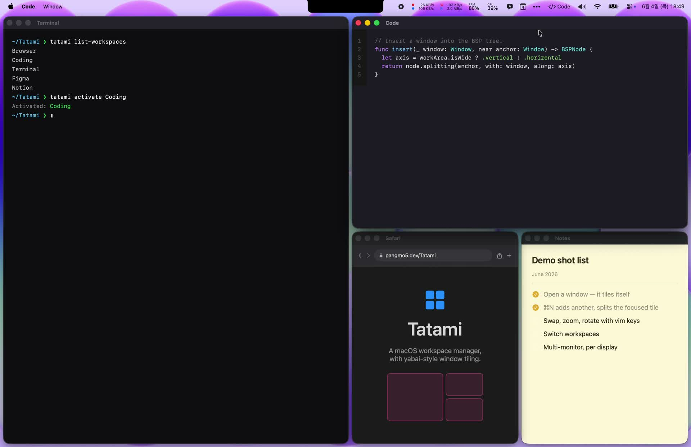

# Tatami 

[](https://github.com/PangMo5/Tatami/releases/latest)
[](https://github.com/PangMo5/Tatami/releases)

[](LICENSE)

A macOS workspace manager with yabai-style window tiling.

Tatami groups your apps into virtual workspaces you switch between with a
keystroke or a trackpad swipe, and tiles their windows automatically with a
yabai-style BSP engine — no SIP changes and no shell scripting required.

> **Status:** In active development. Config format and shortcuts may still change.

## Demo

<p align="center">
  <a href="https://pangmo5.dev/Tatami#demo">
    
  </a>
</p>

<p align="center"><a href="https://pangmo5.dev/Tatami#demo">▶ Watch the demo</a></p>

## Features

### Tiling (yabai-style BSP)

- Automatic binary space partitioning that inserts at the shallowest tile
- Directional focus, swap, and resize (vim-like `h` / `j` / `k` / `l`)
- Zoom a window to fill the workspace; toggle split orientation
- Rotate, mirror, and balance the layout tree
- Drag a window to swap or re-insert it next to another — a live overlay previews where it'll land (center = swap, edges = insert that side); manual edge-resize syncs back into the tree
- Configurable inner / outer gaps

### Workspaces

- Group apps into virtual workspaces with per-workspace app assignments
- Switch by hotkey, trackpad swipe, or "recent workspace"
- Optional loop-around, skip-empty, and follow-app-focus behaviors
- Auto-open assigned apps when a workspace activates — and reopen them on re-entry if their window was closed
- Per-display workspaces — pin one to a display or follow apps dynamically; each display keeps its own active workspace, and you can cycle per-display or across every display
- Jump focus between displays, or move the focused app to another workspace
- Shared apps that join every workspace — tiled into each layout, or floating
- Floating windows (per-workspace or shared) stay above the tiles **without disabling SIP** — Tatami mirrors them onto its own always-on-top panels and hands you the real window the moment you reach for it

### Focus & cursor

- focus-follows-mouse and mouse-follows-focus (yabai-style)
- Refocus a remaining window when the focused one closes
- Optionally hide the cursor on a workspace switch

### Interface & config

- Menu bar item showing the active workspace (icon + name)
- On-screen HUD confirming switches, float toggles, membership changes, and more — each individually toggleable, with follow-up hints (e.g. the shortcut that fully removes a just-unfloated app)
- Per-workspace SF Symbol icons
- Native SwiftUI settings
- skhd-style shortcut syntax (e.g. `ctrl + alt - h`)
- Plain-TOML config at `~/.config/tatami/config.toml` (XDG-aware), hot-reloaded
- CLI for scripting (`tatami activate <workspace>`, `tatami list-workspaces`, …)
- Sparkle auto-updates

## Requirements

- macOS 14.0 or later
- Accessibility permission
  (System Settings → Privacy & Security → Accessibility)
- Screen Recording permission, only if you use floating windows — their
  always-on-top mirrors are ScreenCaptureKit captures
  (System Settings → Privacy & Security → Screen Recording)

## Installation

### Homebrew

```sh
brew install --cask pangmo5/tap/tatami
```

Or download the signed & notarized `.dmg` from the
[latest release](https://github.com/PangMo5/Tatami/releases/latest).

### Build from source

```sh
brew install tuist                     # or: mise install
tuist install && tuist generate --no-open
open Tatami.xcworkspace
```

## Command line

Tatami ships a `tatami` CLI inside the app bundle. Install it from
**Settings → General → Command Line → Install** — this symlinks `tatami` into
`/usr/local/bin` (you'll be asked for your password once). Then:

```sh
tatami list-workspaces          # workspace names in the active profile
tatami list-apps <workspace>    # bundle IDs assigned to a workspace
tatami activate <workspace>     # activate a workspace
tatami version                  # version of the running app
```

The CLI talks to the running app over a local socket, so Tatami must be
running. (Homebrew installs are detected automatically.)

## Configuration

Settings live in `~/.config/tatami/config.toml`, grouped into tables —
`[settings.layout]`, `[settings.focus]`, `[settings.gestures]`,
`[settings.shortcuts]`, and so on. Workspaces, their app assignments, and
shared apps are stored in the same file. Edits made in the app or by hand are
picked up live.

See [docs/CONFIGURATION.md](docs/CONFIGURATION.md) for the full reference —
every key, its default, and the shortcut syntax.

## Tech stack

- **Tuist** — project generation
- **The Composable Architecture (TCA)** — app architecture
- **swift-sharing** — cross-feature state sharing
- **swift-toml** — config persistence
- **swift-yyjson** — fast JSON for the layout store and CLI protocol
- **KeyboardShortcuts** — global hotkey recording
- **SFSafeSymbols** — type-safe SF Symbol catalog
- **Sparkle** — app updates

## Acknowledgements

Tatami is inspired by [FlashSpace] by Wojciech Kulik (the virtual
workspace-switching concept) and [yabai] by koekeishiya (the window-tiling
model). See [NOTICE.md](NOTICE.md) for attribution.

## License

[GPL-3.0](LICENSE).

[FlashSpace]: https://github.com/wojciech-kulik/FlashSpace
[yabai]: https://github.com/koekeishiya/yabai
