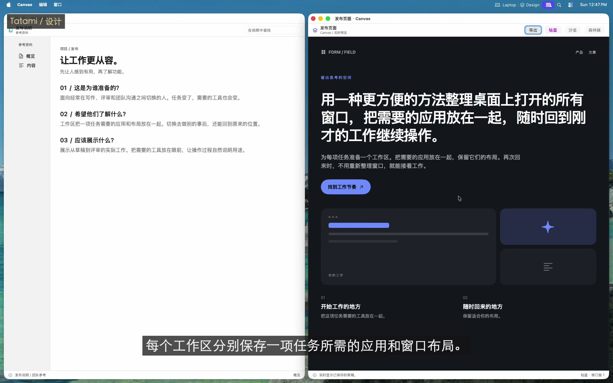
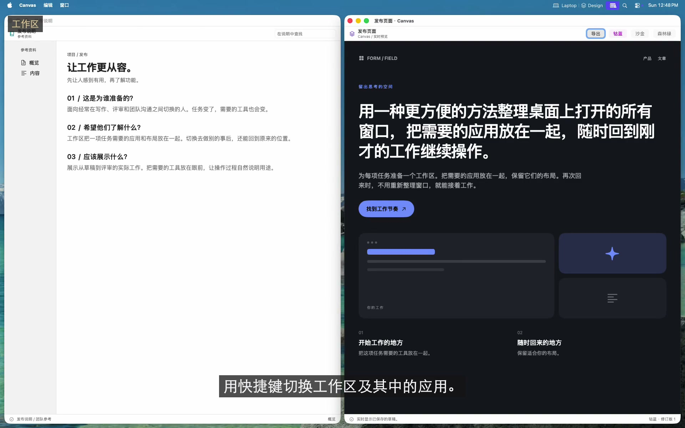
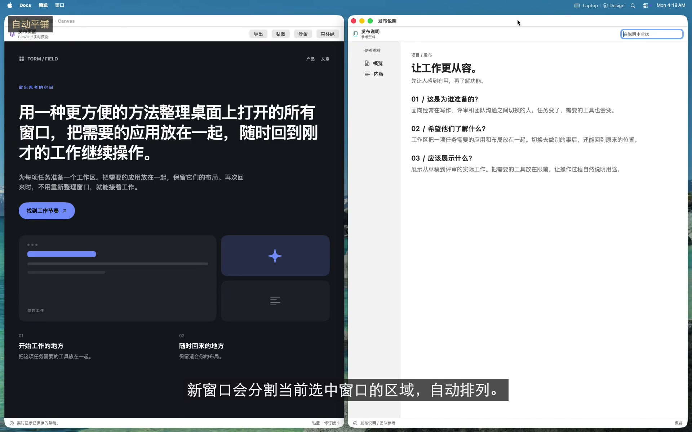
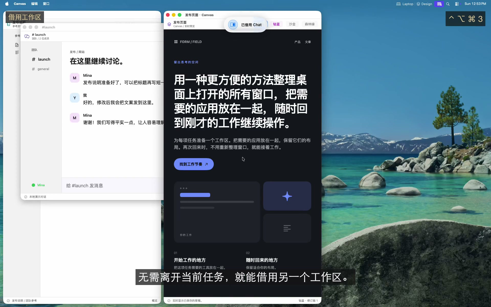

<!-- LANGUAGE-LINKS:START -->
[English](README.md) · [한국어](README.ko.md) · [日本語](README.ja.md) · [简体中文](README.zh-Hans.md) · [繁體中文](README.zh-Hant.md)
<!-- LANGUAGE-LINKS:END -->

<a id="tatami"></a>
# Tatami 

[](https://github.com/PangMo5/Tatami/releases/latest) [](https://github.com/PangMo5/Tatami/releases)  [](LICENSE)

支持 BSP 窗口平铺的 macOS 工作区管理器。

Tatami 把应用组织到虚拟工作区，通过快捷键或自定义触控板手势切换，并用二叉空间分割（BSP）引擎自动平铺窗口。无需修改 SIP，也无需编写 shell 脚本。

<a id="see-tatami-in-action"></a>
## 看看 Tatami 的实际操作

[](https://pangmo5.dev/Tatami/zh-Hans/#demo)

**[观看完整工作流程](https://pangmo5.dev/Tatami/zh-Hans/#demo)**：设计、写作、评审、借用待办事项、自动准备专注环境，再连接第二个显示器。窗口由实际的 Tatami 管理，应用和内容为演示素材。快捷键采用本次演示的配置。

<details>
<summary>设置与设置向导截图</summary>

<p align="center">
  
</p>

<p align="center"><sub>原图：<a href="Resources/Marketing/screenshots/guided-setup.png">引导设置</a> · <a href="Resources/Marketing/screenshots/workspaces.png">工作区</a> · <a href="Resources/Marketing/screenshots/borrow.png">借用</a><br> 截图来自较早版本，部分标签已更新。</sub></p>


</details>

<a id="features"></a>
## 主要功能

<a id="workspaces"></a>
### 工作区
[](https://pangmo5.dev/Tatami/zh-Hans/#demo-workspaces)


- **虚拟工作区：** 按工作区分配和组织应用。
- **灵活切换：** 使用快捷键、触控板手势或最近工作区操作。
- **自定义手势：** 为三指、四指滑动的各个方向绑定快捷键操作，也可以指定某个配置方案或工作区。
- **每个工作区一个按键：** 将切换、分配或借用修饰键与**工作区按键**组合使用。同一套按键也用于最近、下一个和上一个目标，每项操作还可以单独覆盖。
- **可选切换行为：** 启用循环、跳过空工作区或跟随应用焦点。
- **[自动打开演示](https://pangmo5.dev/Tatami/zh-Hans/#demo-autoopen)：** 激活工作区时启动分配的应用，重新进入时打开之前关闭的窗口。
- **每个显示器独立管理：** 固定工作区到显示器，或在指针所在屏幕打开动态工作区。各显示器在重启后仍保留当前和最近工作区；前后切换与最近切换可分别限定为当前屏幕或所有屏幕。
- **工作区链：** 在配置方案内按顺序连接工作区。切换到任一成员时，按链优先级恢复可用伙伴，遵守已连接显示器的固定位置和链动态分配，焦点仍留在所选工作区。
- **跨显示器控制：** 在显示器间移动焦点，或把聚焦的应用移到其他工作区。
- **共享应用：** 添加应出现在每个工作区的应用。

<a id="window-tiling-bsp"></a>
### 窗口平铺（BSP）
[](https://pangmo5.dev/Tatami/zh-Hans/#demo-tiling)


- **自动 BSP 布局：** 把新窗口插入层级最浅的区域。
- **键盘操作：** 用类似 vim 的 `h`、`j`、`k`、`l` 按方向移动焦点、交换和调整大小。
- **交互式窗口切换：** 轻按立即切换，按住修饰键显示紧凑的应用与窗口列表。范围限定为指针所在显示器，可包含共享应用；可查看状态并用键盘或指针选择准确目标。
- **放大与分割：** 让一个窗口铺满工作区，或切换分割方向。
- **布局树变换：** 旋转、镜像和均衡布局。
- **拖移编辑：** 通过实时预览交换或重新插入窗口，手动调整边缘也会同步到布局树。
- **持久布局：** 切换工作区、重新启动和系统睡眠后，保留布局树及比例。
- **可调间距：** 设置内部和外部间距。

<a id="profiles"></a>
### 配置方案

[观看配置方案与双屏演示](https://pangmo5.dev/Tatami/zh-Hans/#profiles)。

- **独立配置方案：** 分组管理工作区，一次切换整套环境。每个方案分别保存工作区、应用分配和快捷键。
- **快速切换方案：** 通过快捷键或菜单栏切换，所有显示器重新平铺，重启后返回合适的配置方案。
- **按显示器激活：** 根据数量或指定显示器的连接、断开状态自动切换。同优先级规则重叠时会警告。
- **方案图标：** 选择显示在侧边栏、菜单栏和切换反馈中的 SF Symbol。
- **复用现有配置：** **复制自**和**复制**共用预览，在更改前选择保留或跳过工作区、应用、设置和保存的布局。

<a id="borrow-compose-two-workspaces"></a>
### 借用：组合两个工作区
[](https://pangmo5.dev/Tatami/zh-Hans/#demo-borrow)


- **并排组合：** 把另一个工作区借到屏幕任一边缘，两个区域独立平铺，窗口不会越界。
- **实时双向：** 借来的区域就是实际工作区，编辑会保留下来。
- **方向放置：** 按借用修饰键和工作区按键，再用 `h`、`j`、`k`、`l` 或方向键。也可设置全局或每工作区的默认方向和大小。
- **跨边界焦点和切换：** 方向焦点与鼠标跟随焦点可跨区域移动；归还前，两侧平铺窗口共享切换顺序。激活借来的工作区会完整切换，再次借用默认归还，`esc` 取消放置。
- **显示归属：** 借来的窗口显示所属工作区图标。
- **暂存区：** 仅供借用，不参与普通切换，也不会单独激活，调出时自动打开应用。

<a id="always-on-top"></a>
### 置顶

[观看跨工作区的共享状态窗口](https://pangmo5.dev/Tatami/zh-Hans/#demo-shared)。

- **单独或共享：** 在一个工作区置顶应用，或加入共享应用后在所有工作区置顶。
- **无需修改 SIP：** 使用置顶的 ScreenCaptureKit 镜像，交互时切换到实际窗口。
- **可预测的堆叠：** 多个置顶窗口按最近焦点顺序堆叠，需要屏幕录制权限。
- **保持原样：** 保留位置和大小，同时参与自动打开、焦点、焦点跟随鼠标和窗口切换，无需镜像或屏幕录制权限。

<a id="focus--cursor"></a>
### 焦点与指针

[观看焦点跟随键盘和指针](https://pangmo5.dev/Tatami/zh-Hans/#demo-focus)。

- **两种明确的焦点模式：** 焦点跟随鼠标让指针下方的窗口获得键盘焦点；鼠标跟随焦点在 Tatami 切换窗口后移动指针，包含置顶、共享置顶和保持原样窗口。
- **关闭后恢复焦点：** 返回剩余窗口中最近使用的窗口。
- **指针控制：** 可在切换工作区时隐藏指针。

<a id="interface--config"></a>
### 界面与配置

[观看实际 CLI、钩子和实时配置](https://pangmo5.dev/Tatami/zh-Hans/#automation)。

- **五种界面语言：** 跟随 macOS 应用语言设置，支持英语、韩语、日语、简体中文和繁体中文（台湾）。
- **自定义菜单栏：** 显示当前工作区的图标或名称，并可显示活动配置方案的图标或名称。
- **自适应操作反馈：** 在相关显示器上以简洁的弹性动画确认工作区、配置方案、置顶、成员关系、布局和借用操作。可选九个位置、三种大小，或通过 HUD 钩子把相同的本地化数据传给其他界面。
- **工作区图标：** 为每个工作区选择 SF Symbol。
- **原生设置：** 在 SwiftUI 界面中配置 Tatami。
- **skhd 风格快捷键：** 例如 `ctrl + alt - h`。
- **纯文本 TOML：** 编辑 `~/.config/tatami/config.toml`，支持 XDG 和实时重载。
- **原生钩子编辑器：** 在**设置 → 钩子**中添加、编辑、删除、启用或禁用生命周期和操作反馈钩子，配置可执行文件、argv、环境变量、工作目录和超时。
- **可脚本化 CLI：** 使用 `tatami workspace activate <workspace>`、`tatami workspace list` 等领域命令。
- **自动更新：** 通过 Sparkle 获取新版本。

<a id="guided-setup"></a>
### 设置向导

[观看快捷键练习和建议检查](https://pangmo5.dev/Tatami/zh-Hans/#guided-setup)。

- **边用边学：** 首次启动时，在安全的虚拟桌面依次学习工作区、切换与手势、BSP 平铺、借用与暂存区、置顶与保持原样、MFF/FFM 和应用窗口切换。
- **基于这台 Mac：** 使用运行中应用的信息和已连接显示器的几何数据，按重复进行的任务组织应用，而非套用通用分类。不捕获屏幕内容。
- **可选 AI 规划：** 检查 ChatGPT、Claude、Gemini、其他 AI 或支持的 Mac 上设备端 Apple Intelligence 提出的任务配置。应用前始终只是建议。
- **连续练习界面：** 实际快捷键和触控板手势控制预览，之前学过的命令在后续课程中仍可使用。
- **先用草稿：** 点击**应用设置**前，不移动实际窗口或写入 `config.toml`。可随时从**设置 → 通用**重新打开。

<a id="requirements"></a>
## 系统要求

- macOS 14.0 或更新版本
- 辅助功能权限（系统设置 → 隐私与安全性 → 辅助功能）
- 仅使用置顶时需要屏幕录制权限，置顶镜像来自 ScreenCaptureKit 捕获（系统设置 → 隐私与安全性 → 屏幕录制）。

<a id="installation"></a>
## 安装

<a id="homebrew"></a>
### Homebrew

```sh
brew install --cask pangmo5/tap/tatami
```

也可从[最新版本](https://github.com/PangMo5/Tatami/releases/latest)下载已签名并公证的 `.dmg`。每个版本都链接到对应的准确源代码归档。

<a id="build-from-source"></a>
### 从源代码构建

```sh
brew install tuist                     # or: mise install
tuist install && tuist generate --no-open
open Tatami.xcworkspace
```

<a id="configuration-and-automation"></a>
## 配置与自动化

<a id="configuration"></a>
### 配置指南

设置保存在 `~/.config/tatami/config.toml`，分为 `[settings.layout]`、`[settings.focus]`、`[settings.gestures]`、`[settings.shortcuts]` 等表。工作区、应用分配和共享应用也在同一文件中。生命周期钩子可在**设置 → 钩子**或 `[[hooks]]` 中管理。GUI 分别保存可执行文件和各 argv，不把 `command` 当作 shell 字符串。应用内或手动修改都会实时生效。

完整键、默认值和快捷键语法见 [docs/CONFIGURATION.md](docs/zh-Hans/CONFIGURATION.md)。

关于各应用的窗口行为，包括浮动会议控件和跨工作区的画中画，请参阅[故障排查](docs/zh-Hans/TROUBLESHOOTING.md)。

<a id="command-line"></a>
### 命令行

应用内置 `tatami` CLI。从**设置 → 通用 → 命令行 → 安装**进行安装，把 `tatami` 符号链接到 `/usr/local/bin`，会请求一次密码。之后可执行：

```sh
tatami workspace list
tatami workspace activate "Browser"
tatami profile activate "Dual"
tatami window focus left
tatami layout balance
```

CLI 按领域提供配置方案与工作区管理、钩子查询、稳定 JSON 输出，以及与手势相同的焦点、布局、应用、平铺、循环切换和借用操作。Tatami 必须正在运行。

阅读[完整 CLI 参考](docs/zh-Hans/CLI.md)，或在 [pangmo5.dev/Tatami](https://pangmo5.dev/Tatami/zh-Hans/cli.html) 查看网页版本。

<a id="tech-stack"></a>
## 技术栈

- **Tuist：** 项目生成
- **The Composable Architecture（TCA）：** 应用架构
- **swift-sharing：** 跨功能状态共享
- **swift-collections：** 平铺关键路径中的有序集合、字典和双端队列
- **swift-toml：** 配置持久化
- **swift-subprocess：** 可取消且有时间边界的钩子执行
- **swift-yyjson：** 布局存储和 CLI 协议中的快速 JSON
- **Magnet：** 基于 Carbon 的全局快捷键
- **SFSafeSymbols：** 类型安全的 SF Symbol 目录
- **Sparkle：** 应用更新

<a id="acknowledgements"></a>
## 致谢

Tatami 受到 Wojciech Kulik 的 [FlashSpace]（虚拟工作区切换概念）和 koekeishiya 的 [yabai]（窗口平铺模型）启发。署名见 [NOTICE.md](NOTICE.zh-Hans.md)，依赖许可证见 [THIRD_PARTY_NOTICES.md](THIRD_PARTY_NOTICES.md)。

<a id="license"></a>
## 许可证

[AGPL-3.0-only](LICENSE)。

[FlashSpace]: https://github.com/wojciech-kulik/FlashSpace
[yabai]: https://github.com/koekeishiya/yabai
