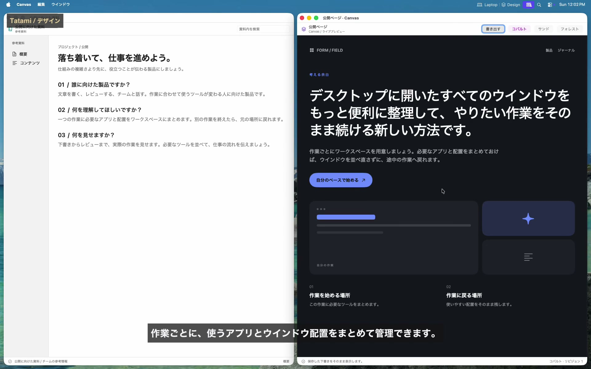
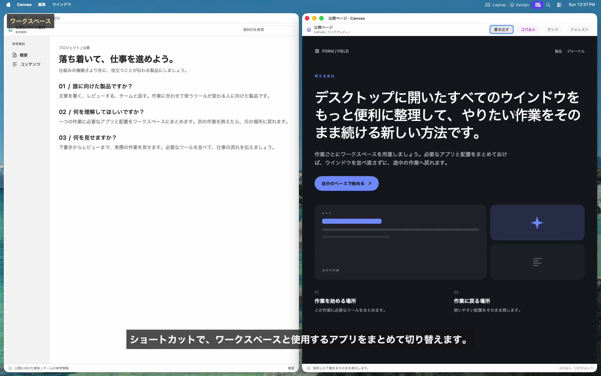
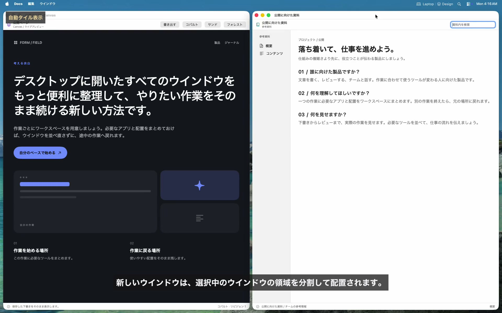
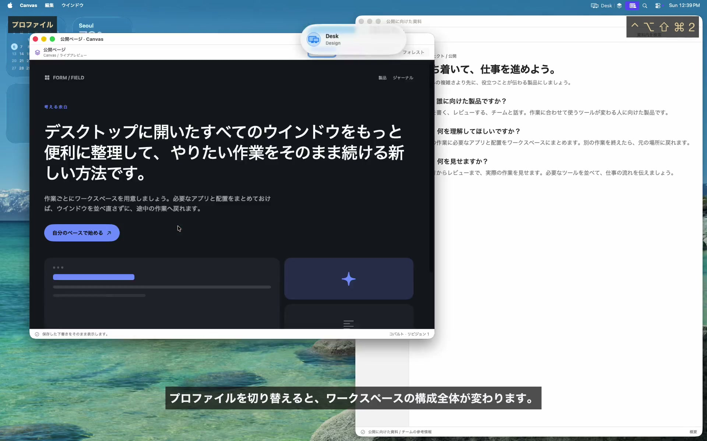
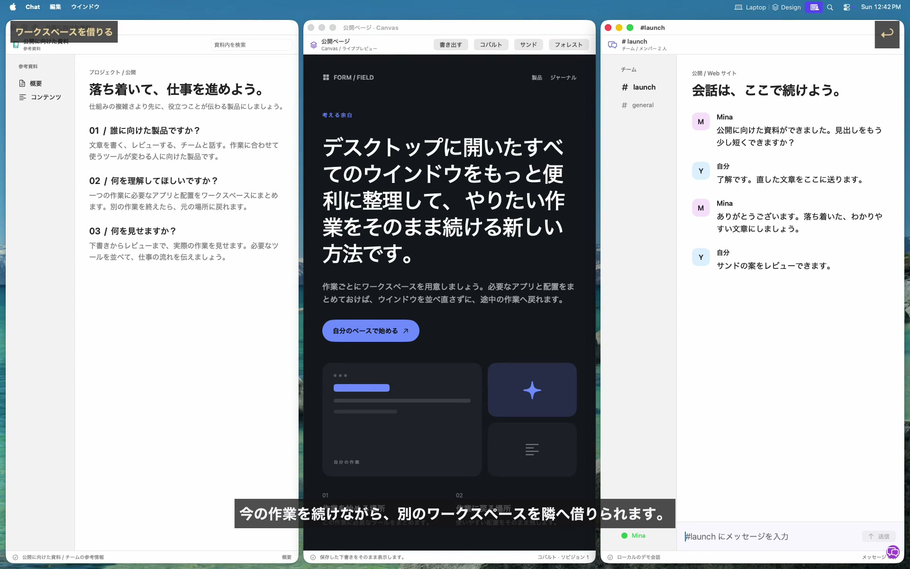
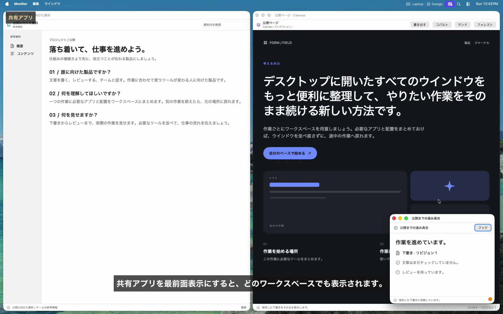
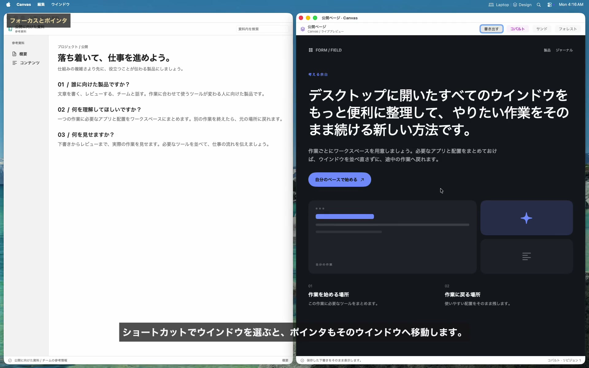
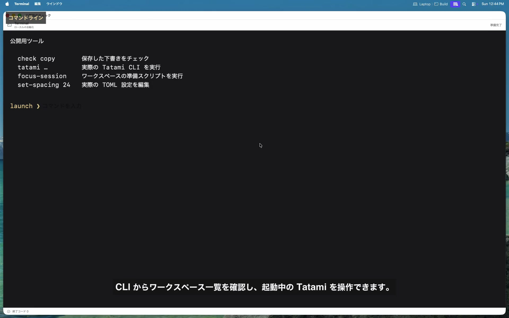
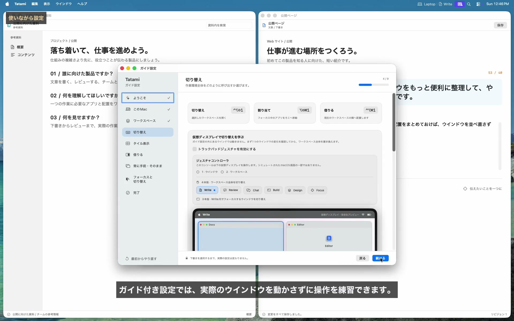

<!-- LANGUAGE-LINKS:START -->
[English](../../README.md) · [한국어](../ko/README.md) · [日本語](README.md) · [简体中文](../zh-Hans/README.md) · [繁體中文](../zh-Hant/README.md)
<!-- LANGUAGE-LINKS:END -->

<a id="tatami"></a>
# Tatami 

[](https://github.com/PangMo5/Tatami/releases/latest) [](https://github.com/PangMo5/Tatami/releases)  [](../../LICENSE)

BSP タイル表示を備えた macOS 用ワークスペースマネージャです。

Tatami はアプリを仮想ワークスペースにまとめ、キーや設定したトラックパッドのジェスチャで切り替えます。BSP エンジンがウインドウを自動で整えるので、SIP の変更やシェルスクリプトは不要です。

<a id="see-tatami-in-action"></a>
## Tatami の使い方を見る

[](https://pangmo5.dev/Tatami/ja/#demo)

**[一連の作業を見る](https://pangmo5.dev/Tatami/ja/#demo)**。デザイン、執筆、レビュー、次の作業を借りる操作、集中環境の自動化、2 台目の画面への対応まで紹介します。実際の Tatami を使い、アプリと内容はデモ用です。表示するキーはこのデモの設定です。

<details>
<summary>設定とガイドのスクリーンショット</summary>

<p align="center">
  
</p>

<p align="center"><sub>元のサイズ：<a href="../../Resources/Marketing/screenshots/guided-setup.png">ガイド設定</a> · <a href="../../Resources/Marketing/screenshots/workspaces.png">ワークスペース</a> · <a href="../../Resources/Marketing/screenshots/borrow.png">借りる</a><br> 以前のバージョンで撮影したため、一部の表記は現在と異なります。</sub></p>

</details>

<a id="features"></a>
## 主な機能

<a id="workspaces"></a>
### ワークスペース

<a href="https://pangmo5.dev/Tatami/ja/#demo-workspaces" title="動画を見る"></a>

- **仮想ワークスペース：** 作業ごとに必要なアプリを割り当ててまとめます。
- **使いやすく切り替え：** ショートカット、トラックパッドのジェスチャ、直前のワークスペースへの移動を使えます。
- **ジェスチャ設定：** 3 本指・4 本指の各方向に操作を割り当てられます。特定のプロファイルやワークスペースへの移動も選べます。
- **ワークスペースごとに一つのキー：** 切り替え・割り当て・借りる操作の修飾キーと**ワークスペースキー**を組み合わせます。直前・次・前への移動にも使え、操作別の上書きもできます。
- **切り替え方を選択：** 端での循環、空の作業をスキップ、アプリのフォーカスへの追従を設定できます。
- **自動起動：** ワークスペースを開くと割り当てたアプリを起動し、ウインドウを閉じた場合も次に開くときに再び表示します。
- **画面ごとの作業：** 特定の画面に固定するか、ポインタのある画面に開けます。再起動後も各画面の現在・直前の作業を記憶し、次・前・直前への移動範囲を個別に設定できます。
- **ワークスペースチェーン：** プロファイル内の作業を順に連結します。どのメンバーを選んでも、優先順・接続中の画面固定・動的配置に従って仲間を復元し、選んだ作業にフォーカスを残します。
- **画面をまたぐ操作：** 別の画面へフォーカスを移したり、選んだアプリを別の作業へ送ったりできます。
- **共有アプリ：** すべてのワークスペースで使うアプリを追加できます。

<br clear="right">

<a id="window-tiling-bsp"></a>
### ウインドウのタイル表示（BSP）

<a href="https://pangmo5.dev/Tatami/ja/#demo-tiling" title="動画を見る"></a>

- **自動 BSP 配置：** 新しいウインドウは、現在の挿入先またはフォーカス中のタイルの隣に配置します。どちらもなければ、ツリーで最も浅いタイルを使います。
- **キーボード操作：** 推奨設定では、`ctrl + alt` と `h`、`j`、`k`、`l` でフォーカスを移動し、矢印キーでウインドウを入れ替え、`=` または `-` でフォーカス中のタイルを拡大・縮小します。
- **ウインドウを選択：** 短く押すとすぐ切り替わり、修飾キーを長く押すと一覧が開きます。ポインタの画面内で動作し、共有アプリも含められます。状態を見ながらキーやマウスで選べます。
- **ズームと分割：** 一つのウインドウを作業全体に広げたり、分割方向を切り替えたりできます。
- **配置の変換：** 回転、反転、均等配置が使えます。
- **ドラッグ編集：** プレビューを見ながら入れ替えや挿入ができます。端を手で調整した比率も配置に反映されます。
- **配置を記憶：** 作業の切り替え、再起動、スリープ後も、ツリーと比率を保ちます。
- **余白の設定：** 内側と外側の余白を選べます。

<br clear="right">

<a id="profiles"></a>
### プロファイル

<a href="https://pangmo5.dev/Tatami/ja/#demo-profiles" title="動画を見る"></a>

- **独立したプロファイル：** 作業をまとめ、構成全体を切り替えます。作業、アプリの割り当て、ショートカットを個別に持ちます。
- **すばやい切り替え：** キーやメニューバーで切り替えます。全画面を新しい構成に整え、再起動後も適切なプロファイルに戻ります。
- **画面に合わせて有効化：** 画面数や特定の画面の接続・取り外しで切り替えます。同じ優先度で条件が重なると警告します。
- **プロファイルのアイコン：** サイドバー、メニューバー、切り替え時に表示する SF Symbol を選べます。
- **構成を再利用：** **コピー元**と**複製**は共通のプレビューで確認できます。変更前に作業、アプリ、設定、保存済み配置を含めるか選べます。

<br clear="right">

<a id="borrow-compose-two-workspaces"></a>
### 借りる：二つの作業を組み合わせる

<a href="https://pangmo5.dev/Tatami/ja/#demo-borrow" title="動画を見る"></a>

- **並べて使う：** 別の作業を画面の端に借りて、両方を独立して配置します。ウインドウは境界を越えません。
- **実際の作業をそのまま：** 借りた領域は実際の作業なので、編集内容も元の場所に残ります。
- **方向を選択：** 借りる修飾キーと作業のキーを押してから、`h`、`j`、`k`、`l` または矢印を使います。全体・作業別の既定位置と大きさも設定できます。
- **境界を越えるフォーカスと切り替え：** 方向操作と MFF で両領域を行き来できます。返すまでは両側のタイルが同じ切り替え順に入り、有効化すると完全に移動、再度借りると通常は返却します。`esc` で配置を取り消せます。
- **所属を表示：** 借りたウインドウに、元のワークスペースのアイコンを表示します。
- **一時スペース：** 借りるための作業です。通常の切り替えや単独の有効化には入らず、呼び出すとアプリが開きます。

<br clear="right">

<a id="always-on-top"></a>
### 常に手前

<a href="https://pangmo5.dev/Tatami/ja/#demo-shared" title="動画を見る"></a>

- **作業別・共有：** 一つの作業だけで手前に置くか、共有アプリにしてどこでも表示できます。
- **SIP 変更不要：** ScreenCaptureKit のミラーを手前に表示し、操作時に実際のウインドウへ渡します。
- **わかりやすい重なり順：** 手前のウインドウは最近選んだ順に重なります。画面収録の許可が必要です。
- **そのまま：** 位置と大きさを保ちながら、自動起動、フォーカス、マウス追従、切り替えに参加します。ミラーや画面収録の許可は不要です。

<br clear="right">

<a id="focus--cursor"></a>
### フォーカスとカーソル

<a href="https://pangmo5.dev/Tatami/ja/#demo-focus" title="動画を見る"></a>

- **二つの方式：** FFM はポインタの下にキーボードフォーカスを移し、MFF は Tatami が選んだウインドウへポインタを移します。手前・共有の手前・そのままのウインドウにも対応します。
- **閉じた後のフォーカス：** 残った中で最近使ったウインドウへ戻ります。
- **カーソル操作：** ワークスペースの切り替え中にカーソルを隠せます。

<br clear="right">

<a id="interface--config"></a>
### 画面と設定

<a href="https://pangmo5.dev/Tatami/ja/#demo-cli" title="動画を見る"></a>

- **5 言語：** macOS のアプリ言語に合わせ、英語・韓国語・日本語・簡体字・繁体字（台湾）で使えます。
- **メニューバーの設定：** 現在の作業のアイコン・名前と、必要に応じてプロファイルの情報を表示できます。
- **操作フィードバック：** 作業、プロファイル、手前表示、割り当て、配置、借りる操作の結果を対象の画面に短く表示します。9 か所・3 サイズから選び、同じ多言語の内容を HUD フックでほかの場所へ送れます。
- **作業のアイコン：** ワークスペースごとに SF Symbol を選べます。
- **ネイティブの設定：** SwiftUI の設定画面で操作できます。
- **skhd 形式：** `ctrl + alt - h` のように書けます。
- **TOML 設定：** `~/.config/tatami/config.toml` を直接編集できます。XDG と即時反映に対応します。
- **フック編集：** **設定 → フック**で状態・操作フィードバックのフックを追加、編集、削除、有効・無効化できます。実行ファイル、引数、環境、作業フォルダ、時間制限も指定できます。
- **CLI 自動化：** `tatami workspace activate <workspace>` や `tatami workspace list` などのコマンドをスクリプトで使えます。
- **自動更新：** Sparkle で新しいリリースを受け取れます。

<br clear="right">

<a id="guided-setup"></a>
### 使いながら設定

<a href="https://pangmo5.dev/Tatami/ja/#demo-guided-setup" title="動画を見る"></a>

- **使いながら学ぶ：** 初回起動時に安全な仮想画面で、作業、切り替え・ジェスチャ、BSP、借りる・一時スペース、手前・そのまま、MFF・FFM、アプリ・ウインドウ切り替えを順に学べます。
- **この Mac から開始：** 実行中アプリの情報と接続画面から下書きを作ります。一般的な分類ではなく繰り返す作業に合わせ、画面の内容は取得しません。
- **任意の AI 提案：** ChatGPT、Claude、Gemini などや、対応 Mac の Apple Intelligence の作業案を確認できます。適用するまでは提案のままです。
- **続けて練習：** 実際のキーやジェスチャでプレビューを操作し、前のレッスンの操作も続けて使えます。
- **まず下書き：** **設定を適用**するまで実際のウインドウや `config.toml` は変えません。**設定 → 一般**からいつでも再開できます。

<br clear="right">

<a id="requirements"></a>
## 必要な環境

- macOS 14.0 以降
- アクセシビリティの許可（システム設定 → プライバシーとセキュリティ → アクセシビリティ）
- 「常に手前」を使う場合だけ画面収録の許可が必要です。ScreenCaptureKit でウインドウを表示します（システム設定 → プライバシーとセキュリティ → 画面収録）。

<a id="installation"></a>
## インストール

<a id="homebrew"></a>
### Homebrew

```sh
brew install --cask pangmo5/tap/tatami
```

[最新リリース](https://github.com/PangMo5/Tatami/releases/latest)から署名・公証済みの `.dmg` を入手することもできます。各リリースには、その版に対応するソースもあります。

<a id="build-from-source"></a>
### ソースからビルド

Xcode 26 以降と Swift 6.2 以降のツールチェーンを使ってください。アプリは macOS 14 以降で動作します。実行環境とビルドツールの要件は別です。

```sh
brew install tuist                     # or: mise install
tuist install && tuist generate --no-open
open Tatami.xcworkspace
```

<a id="configuration-and-automation"></a>
## 設定と自動化

<a id="configuration"></a>
### 設定ガイド

設定は `~/.config/tatami/config.toml` に保存され、`[settings.layout]`、`[settings.focus]`、`[settings.gestures]`、`[settings.shortcuts]` などのテーブルに分かれます。作業、アプリ、共有アプリも同じファイルです。フックは**設定 → フック**か `[[hooks]]` で管理します。GUI は `command` をシェル文字列にせず、実行ファイルと引数を分けて扱い、変更を即時反映します。

全項目、既定値、ショートカットの書き方は [docs/CONFIGURATION.md](CONFIGURATION.md) を参照してください。

会議の操作パネルや作業を切り替えたときのピクチャインピクチャなど、アプリ別の動作は[トラブルシューティング](TROUBLESHOOTING.md)を参照してください。

<a id="command-line"></a>
### コマンドライン

アプリ内に `tatami` CLI を同梱しています。**設定 → 一般 → コマンドライン → インストール**で `tatami` を `/usr/local/bin` にリンクします。パスワードの入力は 1 回です。インストール後は次のように使います。

```sh
tatami workspace list
tatami workspace activate "Browser"
tatami profile activate "Dual"
tatami window focus left
tatami layout balance
```

CLI はプロファイル・作業の管理、フックの確認、安定した JSON 出力に加え、ジェスチャと同じフォーカス、配置、アプリ、タイル表示、切り替え、借りる操作を分類して提供します。Tatami の起動が必要です。

[CLI の完全なガイド](CLI.md)、または [pangmo5.dev/Tatami](https://pangmo5.dev/Tatami/ja/cli.html) の Web 版を参照してください。

<a id="tech-stack"></a>
## 技術構成

- **Tuist：** プロジェクト生成
- **The Composable Architecture（TCA）：** アプリの構成
- **swift-sharing：** 機能間の状態共有
- **swift-collections：** タイル処理の高速経路で使う順序付き集合、辞書、deque
- **swift-toml：** 設定の保存
- **swift-subprocess：** キャンセル・時間制限付きのフック実行
- **swift-yyjson：** 配置保存と CLI 通信の高速 JSON
- **Magnet：** Carbon ベースのグローバルショートカット
- **SFSafeSymbols：** 型安全な SF Symbol カタログ
- **Sparkle：** アプリの更新

<a id="acknowledgements"></a>
## 参考にしたプロジェクト

Tatami は Wojciech Kulik の [FlashSpace]（仮想作業の切り替え）と koekeishiya の [yabai]（タイル表示のモデル）を参考にしています。帰属は [NOTICE.md](NOTICE.md)、依存ライセンスは [THIRD_PARTY_NOTICES.md](../../THIRD_PARTY_NOTICES.md) を参照してください。

<a id="license"></a>
## ライセンス

[AGPL-3.0-only](../../LICENSE)。

[FlashSpace]: https://github.com/wojciech-kulik/FlashSpace
[yabai]: https://github.com/koekeishiya/yabai
