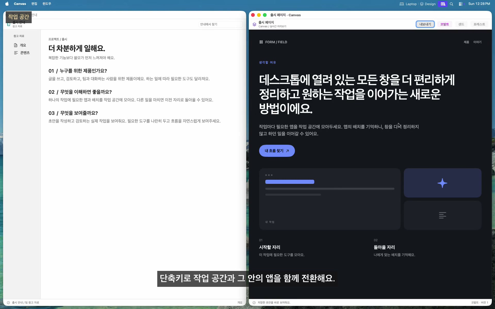
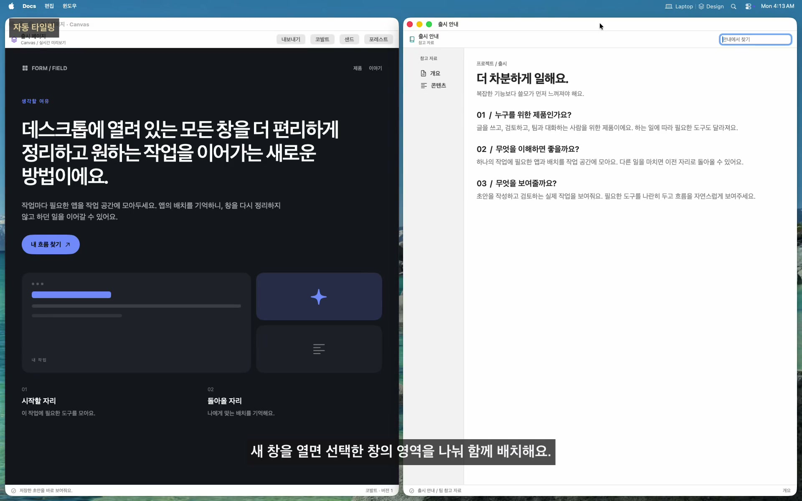
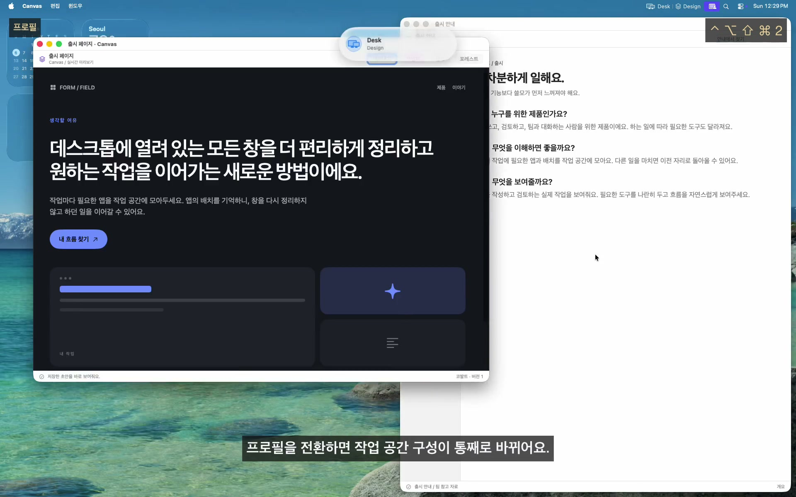
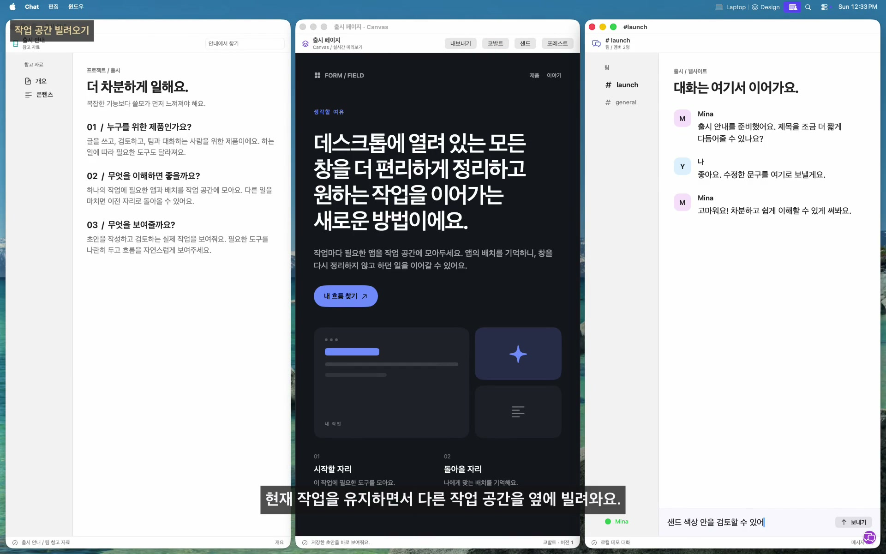
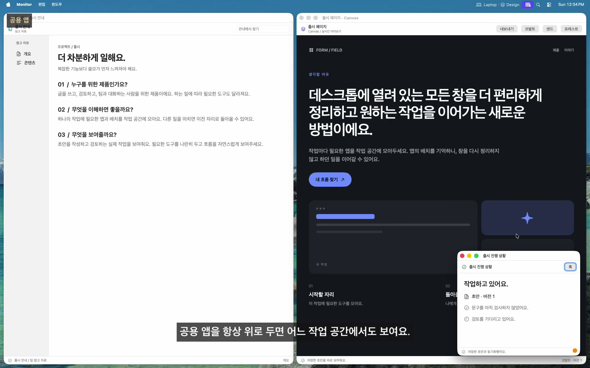
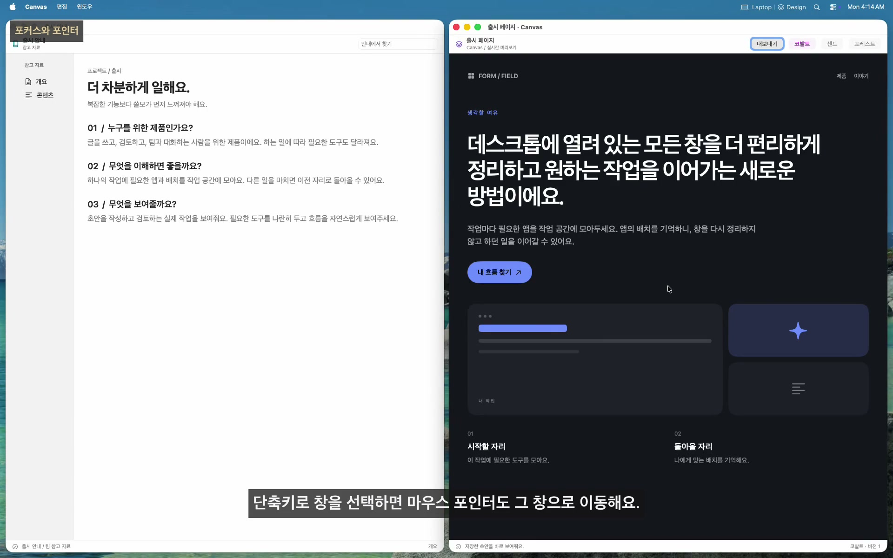
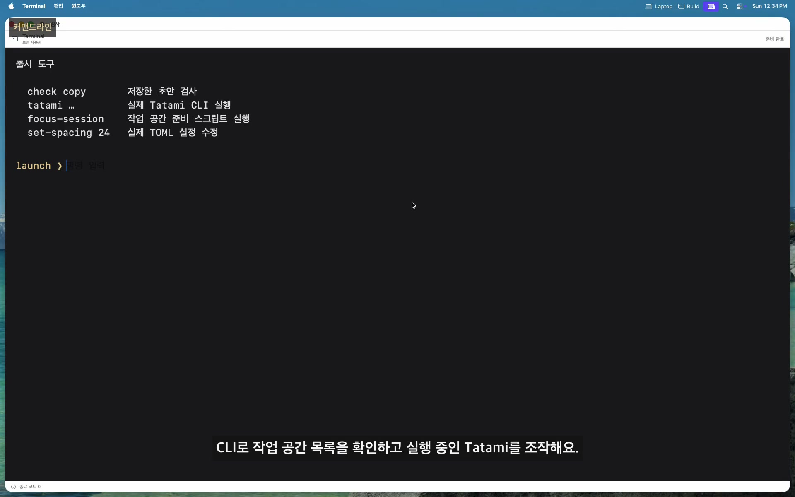
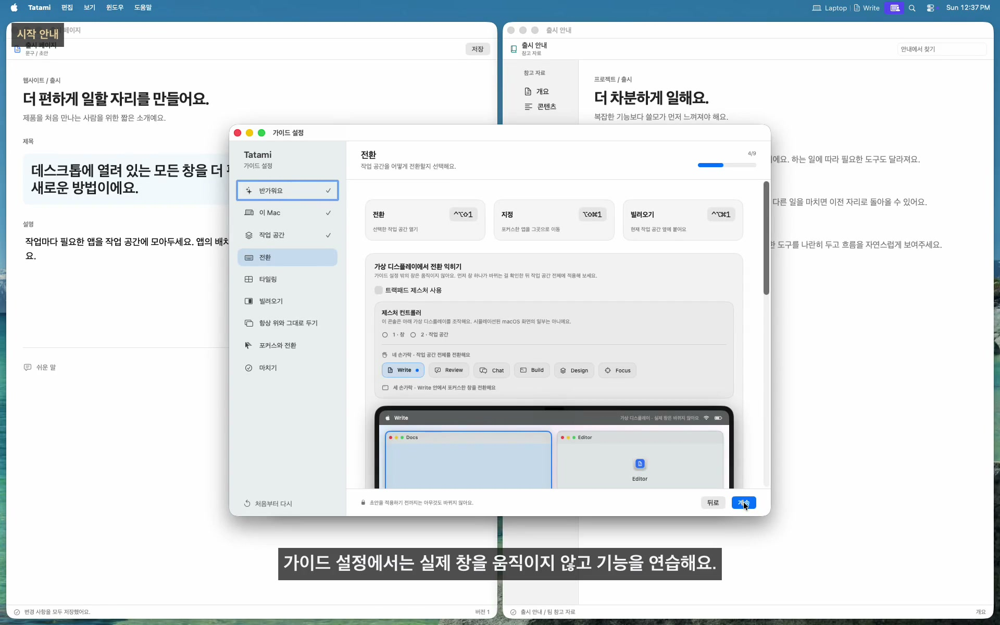

<!-- LANGUAGE-LINKS:START -->
[English](../../README.md) · [한국어](README.md) · [日本語](../ja/README.md) · [简体中文](../zh-Hans/README.md) · [繁體中文](../zh-Hant/README.md)
<!-- LANGUAGE-LINKS:END -->

<a id="tatami"></a>
# Tatami 

[](https://github.com/PangMo5/Tatami/releases/latest) [](https://github.com/PangMo5/Tatami/releases)  [](../../LICENSE)

BSP 창 타일링을 갖춘 macOS 작업 공간 관리자예요.

*다다미*(畳)는 일본 전통 방의 바닥에 맞춰 까는 매트예요. 다다미를 맞춰 방을 채우듯, Tatami는 창을 배치해 Mac의 작업 공간을 정리해요.

Tatami는 앱을 가상 작업 공간에 모으고, 단축키나 설정한 트랙패드 제스처로 전환해요. BSP 엔진이 창을 자동으로 정리해줘요. SIP 설정을 바꾸거나 셸 스크립트를 작성할 필요가 없어요.

<a id="see-tatami-in-action"></a>
## Tatami 사용 모습

[](https://pangmo5.dev/Tatami/ko/#demo)

**[전체 작업 흐름 보기](https://pangmo5.dev/Tatami/ko/#demo)**. 디자인, 글쓰기, 검토, 다음 할 일 빌려오기, 집중 환경 자동화, 두 번째 화면 연결까지 이어져요. 실제 Tatami로 창을 관리하며 앱과 내용은 데모용이에요. 표시한 단축키는 이 데모에서 설정한 키예요.

<details>
<summary>설정과 시작 안내 스크린샷</summary>

<p align="center">
  
</p>

<p align="center"><sub>원본 크기: <a href="../../Resources/Marketing/screenshots/guided-setup.png">가이드 설정</a> · <a href="../../Resources/Marketing/screenshots/workspaces.png">작업 공간</a> · <a href="../../Resources/Marketing/screenshots/borrow.png">빌려오기</a><br> 이전 버전에서 촬영했어요. 일부 문구는 현재 버전과 달라요.</sub></p>

</details>

<a id="features"></a>
## 주요 기능

<a id="workspaces"></a>
### 작업 공간

<a href="https://pangmo5.dev/Tatami/ko/#demo-workspaces" title="영상 보기"></a>

- **가상 작업 공간:** 작업 공간마다 필요한 앱을 배정해서 모아요.
- **편한 방식으로 전환:** 단축키, 트랙패드 제스처, 최근 작업 공간 이동을 사용할 수 있어요.
- **제스처 설정:** 세 손가락·네 손가락 쓸기의 모든 방향에 동작을 연결해요. 특정 프로필이나 작업 공간으로 가는 명령도 연결할 수 있어요.
- **작업 공간마다 키 하나:** 전환·배정·빌려오기 보조키와 **작업 공간 키**를 함께 눌러요. 같은 키 체계로 최근·다음·이전 작업 공간에도 이동할 수 있고, 각 동작에 별도 단축키를 지정할 수도 있어요.
- **전환 방식 선택:** 끝에서 처음으로 돌아가기, 빈 공간 건너뛰기, 앱 포커스 따라가기를 설정할 수 있어요.
- **자동 열기:** 작업 공간으로 전환하면 지정한 앱을 실행하고, 창을 닫았더라도 다시 들어올 때 열어요.
- **화면별 작업 공간:** 특정 화면에 고정하거나 마우스가 있는 화면에 열 수 있어요. 각 화면은 재실행 후에도 활성·최근 작업 공간을 기억해요. 다음·이전·최근 이동의 범위는 각각 현재 화면이나 전체 화면으로 정할 수 있어요.
- **작업 공간 체인:** 프로필 안의 작업 공간을 순서대로 연결해요. 어느 구성원을 선택해도 체인 우선순위, 연결된 화면 고정, 동적 배치에 따라 함께 놓여요. 포커스는 선택한 작업에 남아요.
- **화면 간 조작:** 다른 화면으로 포커스를 옮기거나 포커스한 앱을 다른 작업 공간에 보낼 수 있어요.
- **공용 앱:** 모든 작업 공간에서 함께 쓸 앱을 추가해요.

<br clear="right">

<a id="window-tiling-bsp"></a>
### 창 타일링(BSP)

<a href="https://pangmo5.dev/Tatami/ko/#demo-tiling" title="영상 보기"></a>

- **자동 BSP 배치:** 새 창을 현재 삽입 지점이나 포커스된 타일 옆에 배치해요. 둘 다 없으면 트리에서 가장 얕은 타일을 사용해요.
- **키보드 조작:** 권장 단축키에서는 `ctrl + alt`과 `h`, `j`, `k`, `l`로 포커스를 옮기고, 화살표 키로 창 위치를 바꾸며, `=` 또는 `-`으로 포커스된 타일을 키우거나 줄여요.
- **창 선택:** 전환 단축키를 짧게 누르면 바로 전환하고, 보조키를 길게 누르면 앱·창 목록이 나타나요. 포인터가 있는 화면 안에서 동작하고 공용 앱도 포함할 수 있어요. 각 창의 상태를 보며 키보드나 마우스로 정확히 고를 수 있어요.
- **확대와 분할:** 창 하나를 작업 공간 크기로 펼치거나 나누는 방향을 바꿔요.
- **배치 변환:** 회전·뒤집기·균등 배치를 사용할 수 있어요.
- **드래그 편집:** 미리보기를 보며 창을 교체하거나 다른 자리에 넣어요. 가장자리를 직접 조절한 비율도 배치에 반영돼요.
- **배치 기억:** 작업 공간 전환, 앱 재실행, 시스템 잠자기 후에도 배치 트리와 비율이 남아요.
- **여백 설정:** 창 사이와 바깥 여백을 정할 수 있어요.

<br clear="right">

<a id="profiles"></a>
### 프로필

<a href="https://pangmo5.dev/Tatami/ko/#demo-profiles" title="영상 보기"></a>

- **독립 프로필:** 작업 공간을 묶어 전체 구성을 한 번에 바꿔요. 프로필마다 작업 공간·앱 배정·단축키를 따로 저장해요.
- **빠른 프로필 전환:** 단축키나 메뉴 막대에서 전환해요. 모든 화면을 새 구성으로 정리하고 재실행 후에도 알맞은 프로필로 돌아와요.
- **화면에 맞춰 활성화:** 화면 수나 특정 화면의 연결·해제에 따라 자동 전환해요. 같은 우선순위의 규칙이 겹치면 알려줘요.
- **프로필 아이콘:** 사이드바·메뉴 막대·전환 알림에 표시할 SF Symbol을 정해요.
- **기존 구성 재사용:** **가져오기**와 **복제**에서 같은 미리보기를 사용해요. 변경 전에 작업 공간·앱·설정·저장한 배치를 골라 포함하거나 제외할 수 있어요.

<br clear="right">

<a id="borrow-compose-two-workspaces"></a>
### 빌려오기: 두 작업 공간 함께 쓰기

<a href="https://pangmo5.dev/Tatami/ko/#demo-borrow" title="영상 보기"></a>

- **나란히 사용:** 다른 작업 공간을 화면 가장자리로 빌려와요. 두 영역은 따로 타일링되며 창은 경계를 넘지 않아요.
- **실제 작업 그대로:** 빌려온 영역은 실제 작업 공간이에요. 편집한 내용은 원래 공간에도 남아요.
- **방향 선택:** 빌려오기 보조키와 작업 공간 키를 누른 뒤 `h`, `j`, `k`, `l` 또는 화살표를 눌러요. 전체 또는 작업 공간별 기본 위치와 크기도 설정할 수 있어요.
- **경계를 넘는 포커스와 전환:** 방향 포커스와 포인터 따라가기가 두 영역을 오가요. 돌려보내기 전까지 두 영역의 타일링 창을 함께 전환해요. 빌려온 공간을 활성화하면 완전히 전환하고 다시 빌리면 기본적으로 돌려보내요. `esc`로 위치 선택을 취소해요.
- **소속 표시:** 빌려온 창에는 해당 작업 공간의 아이콘이 보여요.
- **임시 공간:** 빌려오기로만 쓰는 공간이에요. 일반 전환이나 단독 활성화에는 포함되지 않고, 꺼낼 때 필요한 앱이 열려요.

<br clear="right">

<a id="always-on-top"></a>
### 항상 위

<a href="https://pangmo5.dev/Tatami/ko/#demo-shared" title="영상 보기"></a>

- **작업 공간별 또는 공용:** 한 공간에서만 앱을 항상 위에 두거나 공용 앱으로 추가해 어디서나 볼 수 있어요.
- **SIP 변경 불필요:** ScreenCaptureKit 미러를 항상 위에 두고, 조작할 때 실제 창으로 연결해요.
- **예측 가능한 순서:** 항상 위에 둔 여러 창은 최근 포커스한 순서로 쌓여요. 화면 기록 권한이 필요해요.
- **그대로 두기:** 창의 위치와 크기를 유지하면서 자동 열기·포커스·마우스에 따른 포커스·창 전환에 참여해요. 미러나 화면 기록 권한 없이 사용할 수 있어요.

<br clear="right">

<a id="focus--cursor"></a>
### 포커스와 커서

<a href="https://pangmo5.dev/Tatami/ko/#demo-focus" title="영상 보기"></a>

- **두 가지 포커스 방식:** 마우스 따라가기는 포인터 아래 창에 키보드 포커스를 줘요. 포커스 따라가기는 Tatami가 창을 바꿀 때 포인터를 옮겨요. 항상 위·공용 항상 위·그대로 두기 창에서도 동작해요.
- **닫은 뒤 포커스:** 남은 창 중 가장 최근에 쓰던 창으로 돌아가요.
- **커서 제어:** 작업 공간을 전환하는 동안 커서를 숨길 수 있어요.

<br clear="right">

<a id="interface--config"></a>
### 화면과 설정

<a href="https://pangmo5.dev/Tatami/ko/#demo-cli" title="영상 보기"></a>

- **다섯 언어:** macOS 앱 언어 설정에 따라 영어·한국어·일본어·중국어 간체·대만 번체로 쓸 수 있어요.
- **메뉴 막대 설정:** 활성 작업 공간의 아이콘·이름과 필요한 경우 프로필의 아이콘·이름을 표시해요.
- **화면 알림:** 작업 공간·프로필·항상 위·앱 배정·배치·빌려오기 결과를 해당 화면에서 짧은 애니메이션으로 알려줘요. 아홉 위치와 세 크기를 고르거나, 훅으로 같은 다국어 알림을 다른 도구에 전달할 수 있어요.
- **작업 공간 아이콘:** 작업 공간마다 SF Symbol을 고를 수 있어요.
- **네이티브 설정:** SwiftUI로 만든 설정 화면을 사용해요.
- **skhd 형식 단축키:** 예를 들어 `ctrl + alt - h`처럼 써요.
- **TOML 설정:** `~/.config/tatami/config.toml`을 직접 수정할 수 있어요. XDG 경로와 설정 바로 적용을 지원해요.
- **훅 편집기:** **설정 → 훅**에서 수명 주기·화면 알림 훅을 추가·수정·삭제하거나 켜고 끌 수 있어요. 실행 파일, 인자, 환경 변수, 작업 폴더, 제한 시간도 지정해요.
- **CLI 자동화:** `tatami workspace activate <workspace>`, `tatami workspace list` 같은 명령을 스크립트에서 사용할 수 있어요.
- **자동 업데이트:** Sparkle로 새 릴리스를 받아요.

<br clear="right">

<a id="guided-setup"></a>
### 시작 안내

<a href="https://pangmo5.dev/Tatami/ko/#demo-guided-setup" title="영상 보기"></a>

- **직접 배우기:** 처음 실행하면 안전한 가상 화면에서 작업 공간, 전환·제스처, BSP 타일링, 빌려오기·임시 공간, 항상 위·그대로 두기, 포커스·포인터 따라가기, 앱·창 전환을 차례로 익혀요.
- **이 Mac에서 시작:** 실행 중인 앱 정보와 연결된 화면을 바탕으로 초안을 만들어요. 일반적인 분류보다 반복하는 작업에 맞춰 구성하고 화면 내용은 수집하지 않아요.
- **선택할 수 있는 AI 구성:** ChatGPT, Claude, Gemini 등 원하는 AI나 지원하는 Mac의 Apple Intelligence가 제안한 구성을 검토해요. 적용하기 전까지는 제안으로만 남아요.
- **이어서 연습:** 실제 단축키와 제스처로 미리보기를 조작해요. 다음 단계에서도 앞서 익힌 명령을 계속 쓸 수 있어요.
- **초안 먼저:** **설정 적용** 전에는 실제 창을 움직이거나 `config.toml`에 쓰지 않아요. **설정 → 일반**에서 언제든 다시 열 수 있어요.

<br clear="right">

<a id="requirements"></a>
## 필요한 환경

- macOS 14.0 이상
- 손쉬운 사용 권한(시스템 설정 → 개인정보 보호 및 보안 → 손쉬운 사용)
- 항상 위 기능을 사용할 때만 화면 기록 권한이 필요해요. 이 기능은 ScreenCaptureKit으로 창을 캡처해 보여줘요(시스템 설정 → 개인정보 보호 및 보안 → 화면 기록).

<a id="installation"></a>
## 설치

<a id="homebrew"></a>
### Homebrew

```sh
brew install --cask pangmo5/tap/tatami
```

[최신 릴리스](https://github.com/PangMo5/Tatami/releases/latest)에서 서명·공증된 `.dmg`을 내려받을 수도 있어요. 각 릴리스에는 해당 버전의 정확한 소스 코드도 연결되어 있어요.

<a id="build-from-source"></a>
### 소스에서 빌드

Xcode 26 이상과 Swift 6.2 이상의 툴체인을 사용해요. 앱은 macOS 14 이상에서 실행되며, 실행 환경과 빌드 도구의 요구사항은 별개예요.

```sh
brew install tuist                     # or: mise install
tuist install && tuist generate --no-open
open Tatami.xcworkspace
```

<a id="configuration-and-automation"></a>
## 설정과 자동화

<a id="configuration"></a>
### 설정 안내

설정은 `~/.config/tatami/config.toml`에 저장돼요. `[settings.layout]`, `[settings.focus]`, `[settings.gestures]`, `[settings.shortcuts]` 같은 표로 나뉘며 작업 공간·앱 배정·공용 앱도 같은 파일에 있어요. 훅은 **설정 → 훅**이나 파일의 `[[hooks]]`에서 관리해요. GUI는 `command`을 셸 문자열로 합치지 않고 실행 파일과 각 인자를 따로 다뤄요. 앱이나 파일에서 수정하면 바로 반영돼요.

모든 항목과 기본값, 단축키 문법은 [docs/CONFIGURATION.md](CONFIGURATION.md)에서 확인해요.

회의 조작 창이나 작업 공간 전환 중 화면 속 화면처럼 앱마다 다른 동작은 [문제 해결](TROUBLESHOOTING.md)에서 확인해요.

<a id="command-line"></a>
### 커맨드라인

앱 번들 안에 `tatami` CLI가 들어 있어요. **설정 → 일반 → 명령줄 → 설치**에서 설치하세요. `tatami`을 `/usr/local/bin`에 심볼릭 링크로 연결하며 암호를 한 번 요청해요. 설치 후에는 다음처럼 사용해요.

```sh
tatami workspace list
tatami workspace activate "Browser"
tatami profile activate "Dual"
tatami window focus left
tatami layout balance
```

CLI는 프로필·작업 공간 관리, 훅 조회, 안정된 JSON 출력과 제스처로 실행할 수 있는 포커스·배치·앱·타일링·전환·빌려오기 명령을 분야별로 제공해요. Tatami가 실행 중이어야 해요.

[전체 CLI 안내](CLI.md)를 읽거나 [pangmo5.dev/Tatami](https://pangmo5.dev/Tatami/ko/cli.html)에서 웹으로 확인할 수 있어요.

<a id="tech-stack"></a>
## 기술 구성

- **Tuist:** 프로젝트 생성
- **The Composable Architecture(TCA):** 앱 구조
- **swift-sharing:** 기능 간 상태 공유
- **swift-collections:** 타일링 핵심 경로의 순서 있는 집합·사전·데크
- **swift-toml:** 설정 저장
- **swift-subprocess:** 취소 가능하고 실행 시간이 제한된 훅
- **swift-yyjson:** 배치 저장소와 CLI 통신의 빠른 JSON 처리
- **Magnet:** Carbon 기반 전역 단축키
- **SFSafeSymbols:** 타입으로 검증하는 SF Symbol 목록
- **Sparkle:** 앱 업데이트

<a id="acknowledgements"></a>
## 도움을 준 프로젝트

Tatami는 Wojciech Kulik의 [FlashSpace]에서 가상 작업 공간 전환 개념을, koekeishiya의 [yabai]에서 창 타일링 방식을 참고했어요. 출처는 [NOTICE.md](NOTICE.md), 의존성 라이선스는 [THIRD_PARTY_NOTICES.md](../../THIRD_PARTY_NOTICES.md)에서 확인할 수 있어요.

<a id="license"></a>
## 라이선스

[AGPL-3.0-only](../../LICENSE).

[FlashSpace]: https://github.com/wojciech-kulik/FlashSpace
[yabai]: https://github.com/koekeishiya/yabai
