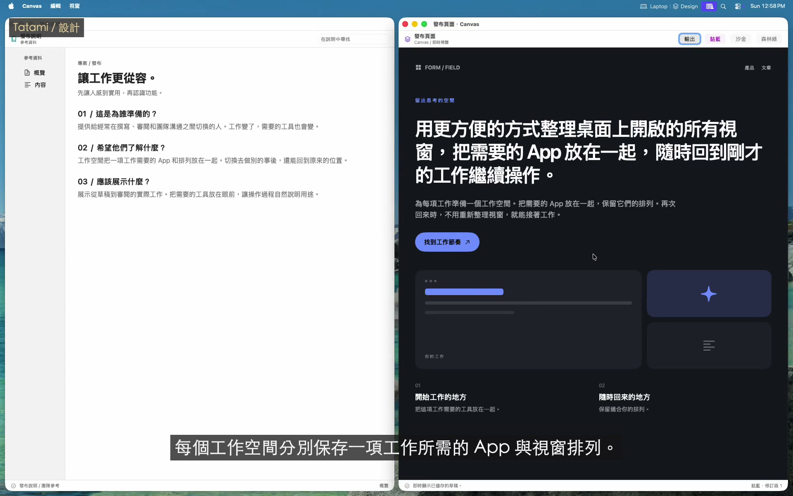
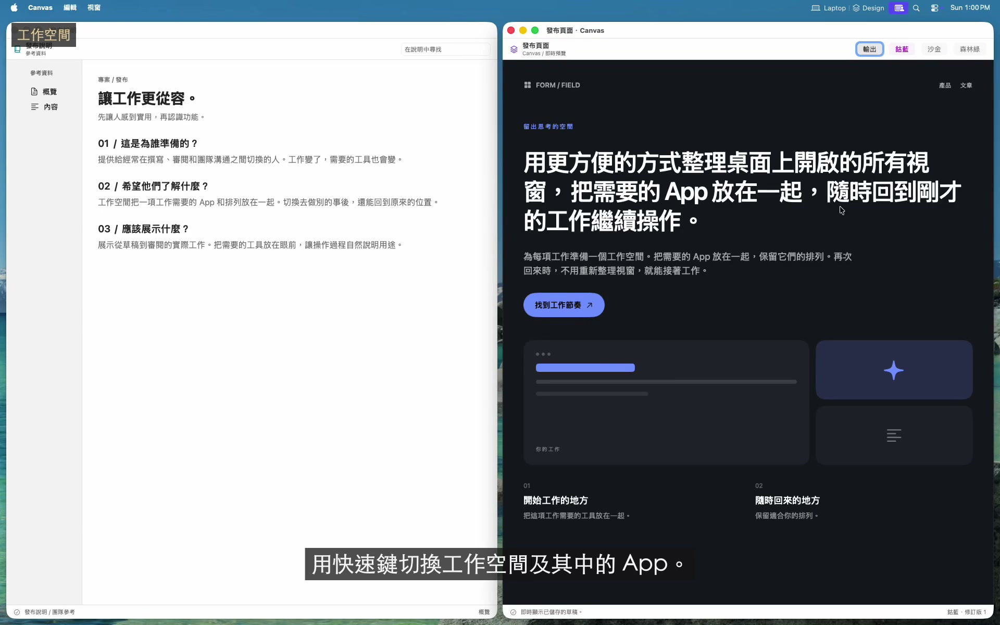
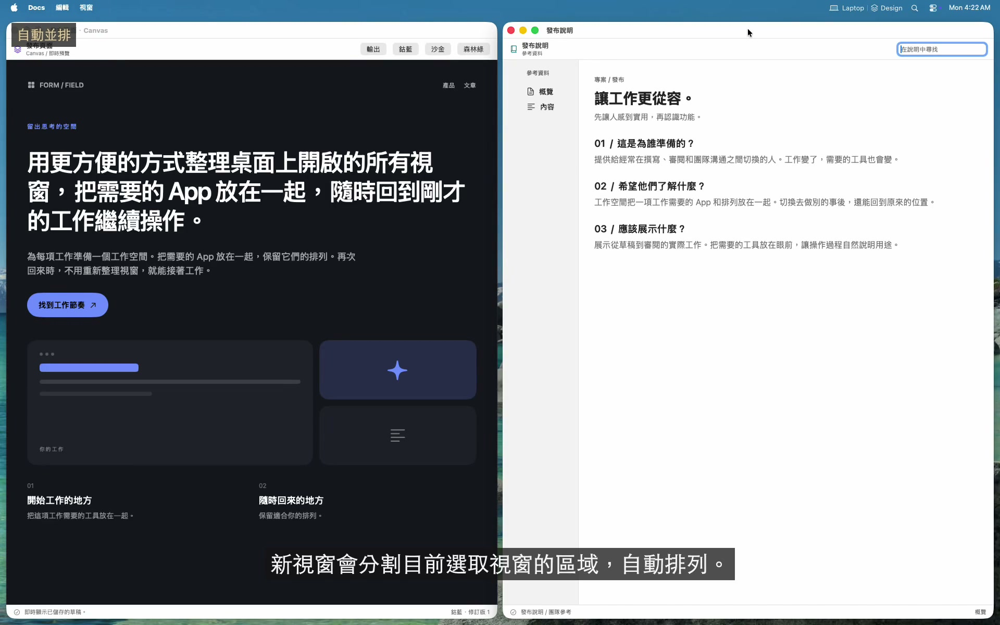
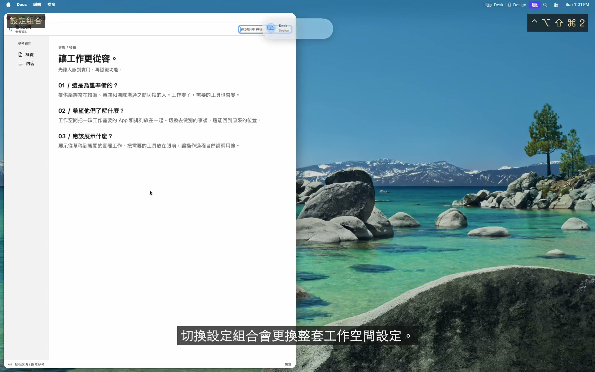
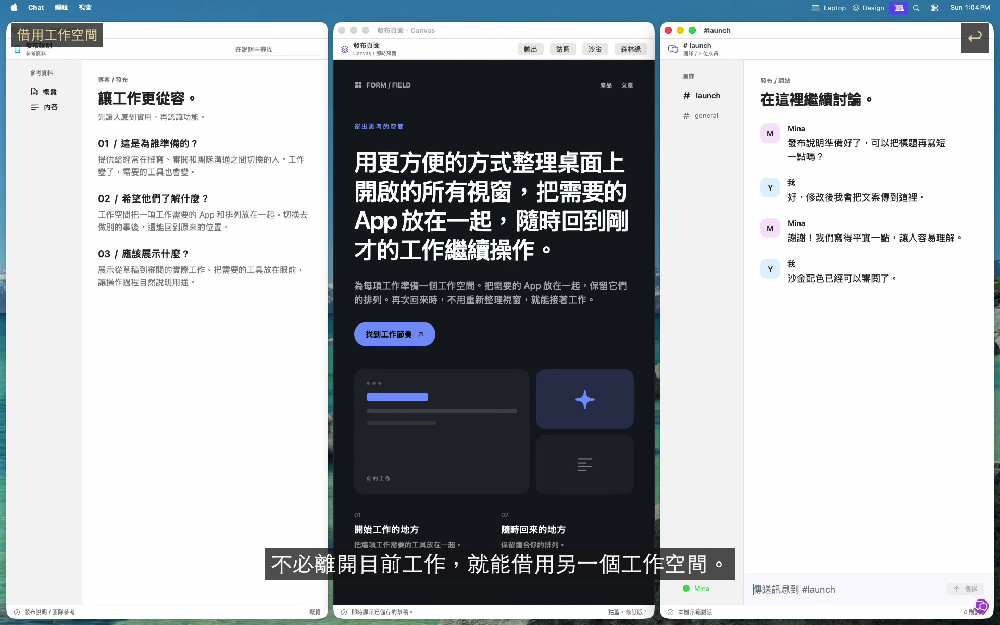
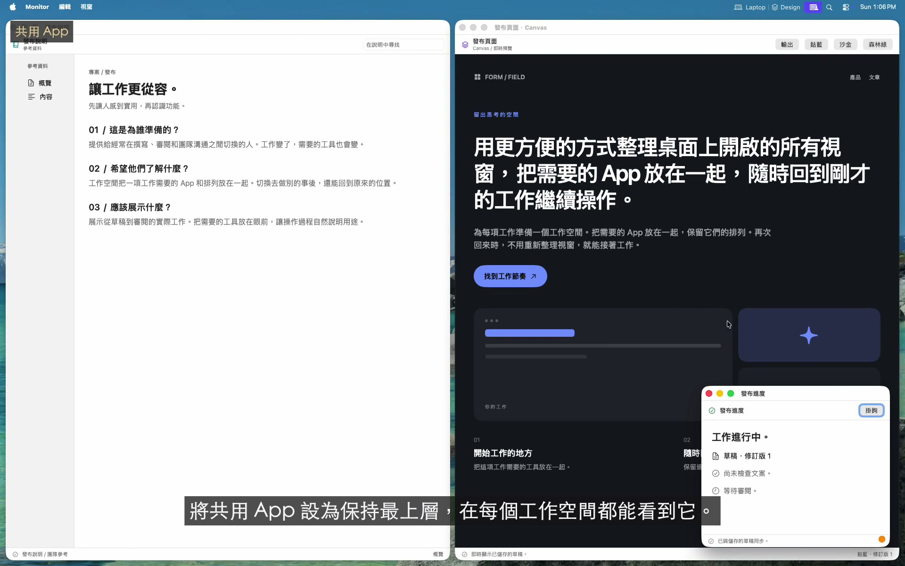
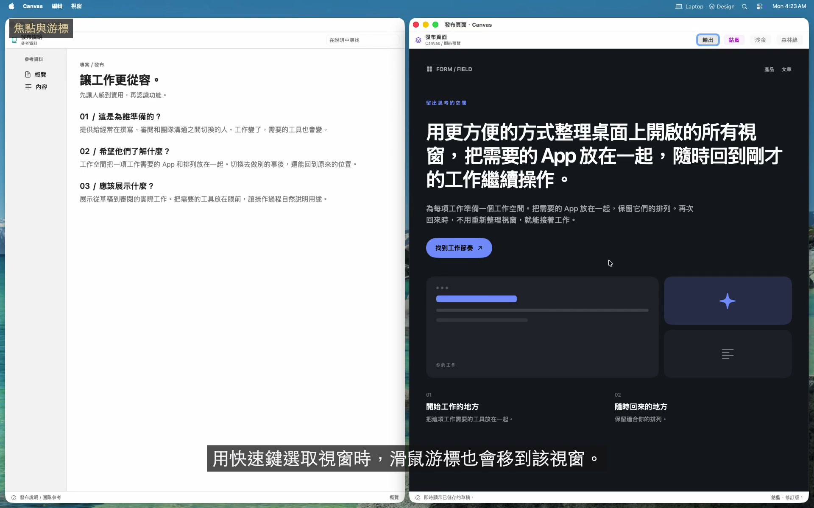
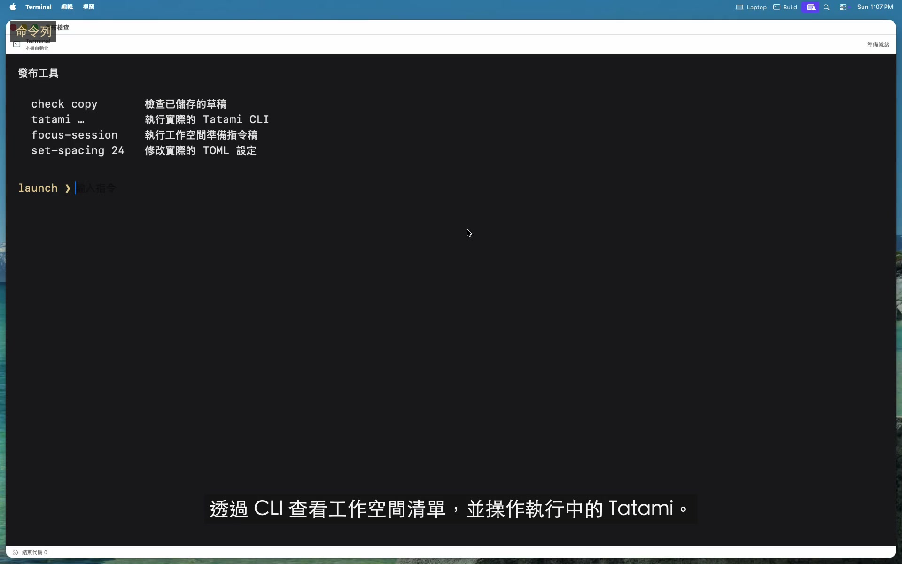
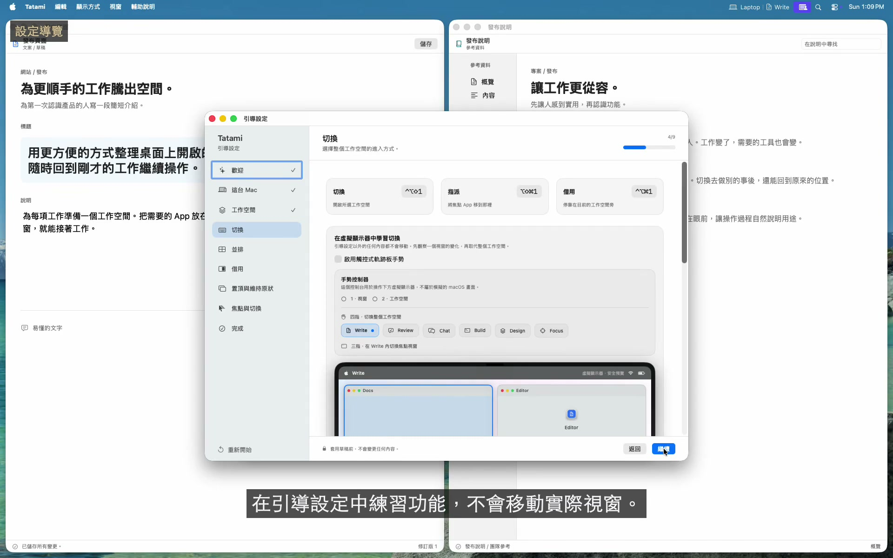

<!-- LANGUAGE-LINKS:START -->
[English](../../README.md) · [한국어](../ko/README.md) · [日本語](../ja/README.md) · [简体中文](../zh-Hans/README.md) · [繁體中文](README.md)
<!-- LANGUAGE-LINKS:END -->

<a id="tatami"></a>
# Tatami 

[](https://github.com/PangMo5/Tatami/releases/latest) [](https://github.com/PangMo5/Tatami/releases)  [](../../LICENSE)

支援 BSP 視窗並排的 macOS 工作空間管理工具。

Tatami 把 App 整理到虛擬工作空間，透過快速鍵或自訂觸控式軌跡板手勢切換，並用二元空間分割（BSP）引擎自動並排視窗。不必修改 SIP，也不必撰寫 shell 指令稿。

<a id="see-tatami-in-action"></a>
## 看看 Tatami 的實際操作

[](https://pangmo5.dev/Tatami/zh-Hant/#demo)

**[觀看完整工作流程](https://pangmo5.dev/Tatami/zh-Hant/#demo)**：設計、撰寫、審閱、借用待辦事項、自動準備專注環境，再連接第二部顯示器。視窗由實際的 Tatami 管理，App 和內容為示範素材。快速鍵採用本次示範的設定。

<details>
<summary>設定與設定導覽截圖</summary>

<p align="center">
  
</p>

<p align="center"><sub>原圖：<a href="../../Resources/Marketing/screenshots/guided-setup.png">引導設定</a> · <a href="../../Resources/Marketing/screenshots/workspaces.png">工作空間</a> · <a href="../../Resources/Marketing/screenshots/borrow.png">借用</a><br> 截圖來自較早版本，部分標籤已更新。</sub></p>

</details>

<a id="features"></a>
## 主要功能

<a id="workspaces"></a>
### 工作空間

<a href="https://pangmo5.dev/Tatami/zh-Hant/#demo-workspaces" title="觀看影片"></a>

- **虛擬工作空間：** 依工作空間指派和整理 App。
- **彈性切換：** 使用快速鍵、觸控式軌跡板手勢或最近工作空間操作。
- **自訂手勢：** 為三指、四指滑動的各個方向綁定快速鍵操作，也可以指定某個設定組合或工作空間。
- **每個工作空間一個按鍵：** 將切換、指派或借用輔助鍵與**工作空間按鍵**組合使用。同一套按鍵也用於最近、下一個和上一個目標，每項操作還可以個別覆寫。
- **可選切換行為：** 啟用循環、略過空工作空間或跟隨 App 焦點。
- **自動開啟：** 啟用工作空間時啟動指定的 App；如果關閉了視窗，再次進入時會重新開啟。
- **每部顯示器獨立管理：** 固定工作空間到顯示器，或在游標所在螢幕開啟動態工作空間。各顯示器在重新啟動後仍保留目前與最近工作空間；前後切換與最近切換可分別限定為目前螢幕或所有螢幕。
- **工作空間鏈：** 在設定組合內依序連接工作空間。切換到任一成員時，依鏈優先順序還原可用夥伴，遵守已連接顯示器的固定位置與鏈動態分配，焦點仍留在所選工作空間。
- **跨顯示器控制：** 在顯示器間移動焦點，或把聚焦的 App 移到其他工作空間。
- **共用 App：** 新增應出現在每個工作空間的 App。

<br clear="right">

<a id="window-tiling-bsp"></a>
### 視窗並排（BSP）

<a href="https://pangmo5.dev/Tatami/zh-Hant/#demo-tiling" title="觀看影片"></a>

- **自動 BSP 配置：** 將新視窗放在目前插入目標或取得焦點的區塊旁。兩者都不可用時，使用樹狀結構中最淺層的區塊。
- **鍵盤操作：** 使用建議快速鍵時，按住 `ctrl + alt`，搭配 `h`、`j`、`k` 或 `l` 移動焦點，搭配方向鍵交換視窗，搭配 `=` 或 `-` 放大或縮小取得焦點的區塊。
- **互動式視窗切換：** 輕按立即切換，按住輔助鍵顯示精簡的 App 與視窗清單。範圍限定為游標所在顯示器，可包含共用 App；可查看狀態並用鍵盤或游標選擇確切目標。
- **放大與分割：** 讓一個視窗鋪滿工作空間，或切換分割方向。
- **排列樹變換：** 旋轉、鏡像與平均排列。
- **拖移編輯：** 透過即時預覽交換或重新插入視窗，手動調整邊緣也會同步到排列樹。
- **保留排列：** 切換工作空間、重新啟動與系統睡眠後，保留排列樹及比例。
- **可調間距：** 設定內部與外部間距。

<br clear="right">

<a id="profiles"></a>
### 設定組合

<a href="https://pangmo5.dev/Tatami/zh-Hant/#demo-profiles" title="觀看影片"></a>

- **獨立設定組合：** 分組管理工作空間，一次切換整套環境。每個組合分別儲存工作空間、App 指派與快速鍵。
- **快速切換組合：** 透過快速鍵或選單列切換，所有顯示器重新並排，重新啟動後返回合適的設定組合。
- **依顯示器啟用：** 根據數量或指定顯示器的連接、中斷狀態自動切換。同優先順序規則重疊時會警告。
- **組合圖像：** 選擇顯示在側邊欄、選單列與切換回饋中的 SF Symbol。
- **重複使用設定：** **拷貝自**與**複製**共用預覽，在變更前選擇保留或略過工作空間、App、設定與儲存的排列。

<br clear="right">

<a id="borrow-compose-two-workspaces"></a>
### 借用：組合兩個工作空間

<a href="https://pangmo5.dev/Tatami/zh-Hant/#demo-borrow" title="觀看影片"></a>

- **並排組合：** 把另一個工作空間借到螢幕任一邊緣，兩個區域獨立並排，視窗不會越界。
- **即時雙向：** 借來的區域就是實際工作空間，編輯會保留下來。
- **方向放置：** 按借用輔助鍵與工作空間按鍵，再用 `h`、`j`、`k`、`l` 或方向鍵。也可設定全域或每個工作空間的預設方向與大小。
- **跨邊界焦點與切換：** 方向焦點與游標跟隨焦點可跨區域移動；歸還前，兩側並排視窗共用切換順序。啟用借來的工作空間會完整切換，再次借用預設歸還，`esc` 取消放置。
- **顯示歸屬：** 借來的視窗顯示所屬工作空間圖像。
- **暫存區：** 僅供借用，不參與一般切換，也不會單獨啟用，叫出時自動開啟 App。

<br clear="right">

<a id="always-on-top"></a>
### 置頂

<a href="https://pangmo5.dev/Tatami/zh-Hant/#demo-shared" title="觀看影片"></a>

- **個別或共用：** 在一個工作空間置頂 App，或加入共用 App 後在所有工作空間置頂。
- **不必修改 SIP：** 使用置頂的 ScreenCaptureKit 鏡像，互動時切換到實際視窗。
- **可預期的堆疊：** 多個置頂視窗依最近焦點順序堆疊，需要螢幕錄製權限。
- **維持原狀：** 保留位置和大小，同時參與自動開啟、焦點、焦點跟隨游標與視窗切換，不必使用鏡像或螢幕錄製權限。

<br clear="right">

<a id="focus--cursor"></a>
### 焦點與游標

<a href="https://pangmo5.dev/Tatami/zh-Hant/#demo-focus" title="觀看影片"></a>

- **兩種明確的焦點模式：** 焦點跟隨游標讓游標下方的視窗取得鍵盤焦點；游標跟隨焦點在 Tatami 切換視窗後移動游標，包含置頂、共用置頂與維持原狀視窗。
- **關閉後還原焦點：** 返回剩餘視窗中最近使用的視窗。
- **游標控制：** 可在切換工作空間時隱藏游標。

<br clear="right">

<a id="interface--config"></a>
### 介面與設定

<a href="https://pangmo5.dev/Tatami/zh-Hant/#demo-cli" title="觀看影片"></a>

- **五種介面語言：** 跟隨 macOS App 語言設定，支援英文、韓文、日文、簡體中文與繁體中文（台灣）。
- **自訂選單列：** 顯示目前工作空間的圖像或名稱，並可顯示作用中設定組合的圖像或名稱。
- **自適應操作回饋：** 在相關顯示器上以精簡的彈性動畫確認工作空間、設定組合、置頂、成員關係、排列與借用操作。可選九個位置、三種大小，或透過 HUD 掛鉤把相同的在地化資料傳給其他介面。
- **工作空間圖像：** 為每個工作空間選擇 SF Symbol。
- **原生設定：** 在 SwiftUI 介面中設定 Tatami。
- **skhd 風格快速鍵：** 例如 `ctrl + alt - h`。
- **純文字 TOML：** 編輯 `~/.config/tatami/config.toml`，支援 XDG 與即時重新載入。
- **原生掛鉤編輯器：** 在**設定 → Hook**中新增、編輯、刪除、啟用或停用生命週期與操作回饋掛鉤，設定執行檔、argv、環境變數、工作目錄與逾時。
- **可指令稿化 CLI：** 使用 `tatami workspace activate <workspace>`、`tatami workspace list` 等領域指令。
- **自動更新：** 透過 Sparkle 取得新版本。

<br clear="right">

<a id="guided-setup"></a>
### 設定導覽

<a href="https://pangmo5.dev/Tatami/zh-Hant/#demo-guided-setup" title="觀看影片"></a>

- **邊用邊學：** 首次啟動時，在安全的虛擬桌面依序學習工作空間、切換與手勢、BSP 並排、借用與暫存區、置頂與維持原狀、MFF/FFM 和 App 視窗切換。
- **基於這部 Mac：** 使用執行中 App 的資訊與已連接顯示器的幾何資料，依重複進行的工作組織 App，而非套用一般分類。不擷取螢幕內容。
- **可選 AI 規劃：** 檢查 ChatGPT、Claude、Gemini、其他 AI 或支援的 Mac 上裝置端 Apple Intelligence 提出的工作設定。套用前始終只是建議。
- **連續練習介面：** 實際快速鍵和觸控式軌跡板手勢控制預覽，之前學過的指令在後續課程中仍可使用。
- **先用草稿：** 點按**套用設定**前，不移動實際視窗或寫入 `config.toml`。可隨時從**設定 → 一般**重新開啟。

<br clear="right">

<a id="requirements"></a>
## 系統需求

- macOS 14.0 或更新版本
- 輔助使用權限（系統設定 → 隱私權與安全性 → 輔助使用）
- 僅使用置頂時需要螢幕錄製權限，置頂鏡像來自 ScreenCaptureKit 擷取（系統設定 → 隱私權與安全性 → 螢幕錄製）。

<a id="installation"></a>
## 安裝

<a id="homebrew"></a>
### Homebrew

```sh
brew install --cask pangmo5/tap/tatami
```

也可從[最新版本](https://github.com/PangMo5/Tatami/releases/latest)下載已簽名並公證的 `.dmg`。每個版本都連結到對應的確切原始碼封存檔。

<a id="build-from-source"></a>
### 從原始碼建置

請使用 Xcode 26 或更新版本，以及 Swift 6.2 或更新版本的工具鏈。App 可在 macOS 14 或更新版本執行；執行環境與建置工具的需求不同。

```sh
brew install tuist                     # or: mise install
tuist install && tuist generate --no-open
open Tatami.xcworkspace
```

<a id="configuration-and-automation"></a>
## 設定與自動化

<a id="configuration"></a>
### 設定指南

設定儲存在 `~/.config/tatami/config.toml`，分為 `[settings.layout]`、`[settings.focus]`、`[settings.gestures]`、`[settings.shortcuts]` 等表。工作空間、App 指派與共用 App 也在同一檔案中。生命週期掛鉤可在**設定 → Hook**或 `[[hooks]]` 中管理。GUI 分別儲存執行檔和各 argv，不把 `command` 當作 shell 字串。App 內或手動修改都會即時生效。

完整鍵、預設值與快速鍵語法請見 [docs/CONFIGURATION.md](CONFIGURATION.md)。

關於各 App 的視窗行為，包含浮動會議控制項與跨工作空間的子母畫面，請參閱[疑難排解](TROUBLESHOOTING.md)。

<a id="command-line"></a>
### 命令列

App 內建 `tatami` CLI。從**設定 → 一般 → 命令列 → 安裝**進行安裝，把 `tatami` 符號連結到 `/usr/local/bin`，會要求一次密碼。之後可執行：

```sh
tatami workspace list
tatami workspace activate "Browser"
tatami profile activate "Dual"
tatami window focus left
tatami layout balance
```

CLI 依領域提供設定組合與工作空間管理、掛鉤查詢、穩定 JSON 輸出，以及與手勢相同的焦點、排列、App、並排、循環切換與借用操作。Tatami 必須正在執行。

閱讀[完整 CLI 參考](CLI.md)，或在 [pangmo5.dev/Tatami](https://pangmo5.dev/Tatami/zh-Hant/cli.html) 查看網頁版本。

<a id="tech-stack"></a>
## 技術架構

- **Tuist：** 專案產生
- **The Composable Architecture（TCA）：** App 架構
- **swift-sharing：** 跨功能狀態共用
- **swift-collections：** 並排關鍵路徑中的有序集合、字典與雙端佇列
- **swift-toml：** 設定持久化
- **swift-subprocess：** 可取消且有時間限制的掛鉤執行
- **swift-yyjson：** 排列儲存與 CLI 協定中的快速 JSON
- **Magnet：** 以 Carbon 為基礎的全域快速鍵
- **SFSafeSymbols：** 型別安全的 SF Symbol 目錄
- **Sparkle：** App 更新

<a id="acknowledgements"></a>
## 致謝

Tatami 受到 Wojciech Kulik 的 [FlashSpace]（虛擬工作空間切換概念）與 koekeishiya 的 [yabai]（視窗並排模型）啟發。歸屬說明見 [NOTICE.md](NOTICE.md)，相依套件授權見 [THIRD_PARTY_NOTICES.md](../../THIRD_PARTY_NOTICES.md)。

<a id="license"></a>
## 授權條款

[AGPL-3.0-only](../../LICENSE)。

[FlashSpace]: https://github.com/wojciech-kulik/FlashSpace
[yabai]: https://github.com/koekeishiya/yabai
